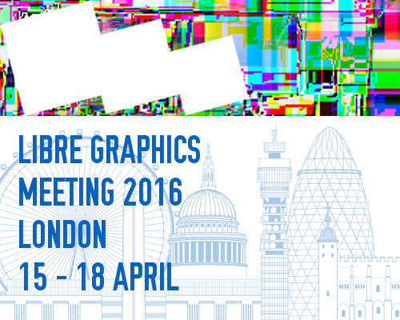

We're heading to London!

<figure>
<a href='http://libregraphicsmeeting.org/2016/'>

</a>
</figure>

I missed LGM last year in Toronto (having a baby - well, my wife was).
I *am* going to be there this year for [LGM/London][]!

<!-- more -->


## Help Support Us

I don't ever do this normally, but you've got to start somewhere, right?

It's my long-term desire to be able to hold a PIXLS meetup/event every year where the community can get together.
Where we can hold workshops, photowalks, and generally share knowledge and information.
For free, for anyone.

*For now though, we need support.*
LGM is a great opportunity for us to meet with many different projects usually having representatives there.  


Donations will help us to offset travel costs to attend LGM as well as a pre-LGM meetup we are holding ([more below][meetup]).
Anything further will go to creating new content and to cover hosting costs for the site.


### Pledgie
I have started a [Pledgie campaign][] to help ease the solicitation of donations:  
https://pledgie.com/campaigns/30905

Here's the fancy little widget they make available:

<a href='https://pledgie.com/campaigns/30905'></a>

If you want to help by adding this button places, here's the code to do it:

```
<a href='https://pledgie.com/campaigns/30905'>

</a>
```

Feel free to use it wherever you think it might help. :)


### PayPal
You can also donate directly via [PayPal][] if you want:

[][PayPal]


### Awareness
I realize that not everyone will be able to donate funds.  No sweat!
If you'd still like to help out then perhaps you can help us raise awareness for the campaign?
The more folks that know about it the better!

Re-tweeting, blogging, linking, yelling on a street corner all help to raise awareness of what we are doing here.
Heck, just invite folks to come read and participate in the community.  Let's help even more people learn about free software!


## Come Join Us

Of course, even better if you are able to make your way to London and actually join us at the [Libre Graphics Meeting 2016][LGM/London]!

The event will be April 15<sup>th</sup> &mdash; 18<sup>th</sup>, hosted by [Westminster School of Media Arts and Design][wsmad], University of Westminster at the Harrow Campus (red marker on the map).

<div class='fluid-vid'>
<iframe src="https://www.google.com/maps/d/embed?mid=zYKepeQNftPo.koxL6CFw1nPk" width="640" height="480" style='border: none;'></iframe>
</div>

The little checkered flag on the map is for something really neat: a PIXLS meetup!


### PIXLS Meet Up

I am going to arrive a day early so that we can have a gathering of PIXLS community folks and anyone else who wants to join us for some photographic fun!

Thanks to the local organizers in London (yay Lara!), we have facilities for us to use.
We will be meeting on Thursday, April 14<sup>th</sup> at the [Furtherfield Commons][commons].
The facilities will be available from 1000 &ndash; 1800 for us to use.

[Furtherfield Commons][commons]<br>
Finsbury Gate &ndash; Finsbury Park<br>
Finsbury Park, London, N4 2NQ<br>

As near as I can tell, here's a street view of the Finsbury Gate:

<div class='fluid-vid'>
<iframe src="https://www.google.com/maps/embed?pb=!1m0!3m2!1sen!2sus!4v1452283931744!6m8!1m7!1sOP5bSwtG8XL-Rdoz2M-RyQ!2m2!1d51.56506385511825!2d-0.1037885701573437!3f315.2912956391929!4f-1.9344543679182067!5f0.7820865974627469" width="600" height="450" frameborder="0" style="border:0" allowfullscreen></iframe>
</div>

I believe the [Commons][commons] building is just inside this gate, and on the left.

In 2014 I held a photowalk with LGM attendees in Leipzig the day before the event that was great fun.
Let's expand the idea and do even more!

<figure>

<figcaption>
Nikolaikirche, Leipzig, from the 2014 LGM photowalk.<br/>
(That's houz in the bottom right)
</figcaption>
</figure>

Here's a Flickr [album of my images from LGM2014 in Leipzig][lgm2014]:

<figure>
<a data-flickr-embed="true" data-header="true" data-footer="true"  href="https://www.flickr.com/photos/patdavid/albums/72157643712169045" title="LGM2014"></a><script async src="//embedr.flickr.com/assets/client-code.js" charset="utf-8"></script>
</figure>

This year I plan on bringing a model along to shoot while we are out and about (my friend [Mairi] if she's available - or a local model if not).
I will also be doing a photowalk again, either in the morning or afternoon.

I am also looking for folks from the community to suggest holding their own photoshoots or workshops, so please step forward and let me know if you'd be interested in doing something!
The facilities have bench seating for approximately 20 people, a big desk, and a projector as well.

Three things that I personally will be doing are (in no particular order):

* Natural + flash portraits and model shooting workshop.
* Photowalk around the park + surrounding environs.
* Portraits + architectural photos for Furtherfield (the hosts).

I am hoping to possibly record some of these workshops and interactions for posterity and others that might not be able to make it to London.
It might be fun to record some shoots for the community to be able to use!

I am also 100% open to suggestions for content that you, the community, might be interested in seeing.
If you have something you'd like me to try (and record), please let me know!

<figure>

<figcaption>
Hopefully <a href='https://www.flickr.com/photos/patdavid/16259030889/in/album-72157632799856846/'>Mairi</a> will be able to make it to London to model for us!
</figcaption>
</figure>


[LGM/London]: http://libregraphicsmeeting.org/2016/
[Pledgie campaign]: https://pledgie.com/campaigns/30905
[PayPal]: https://www.paypal.com/cgi-bin/webscr?cmd=_donations&business=patdavid%40gmail%2ecom&lc=US&item_name=PIXLS%2eUS%20LGM%2FLondon&item_number=pixls-london&currency_code=USD&bn=PP%2dDonationsBF%3abtn_donate_SM%2egif%3aNonHosted

[wsmad]: http://www.westminster.ac.uk/about-us/faculties/media
[GIMP]: https://www.gimp.org
[GNOME]: https://www.gnome.org/ 
[lgm2014]: https://www.flickr.com/photos/patdavid/albums/72157643712169045
[Mairi]: https://www.flickr.com/photos/patdavid/albums/72157632799856846
[furtherfield]: http://furtherfield.org/
[commons]: http://www.furtherfield.org/gallery/visit
[meetup]: #pixls-meet-up
