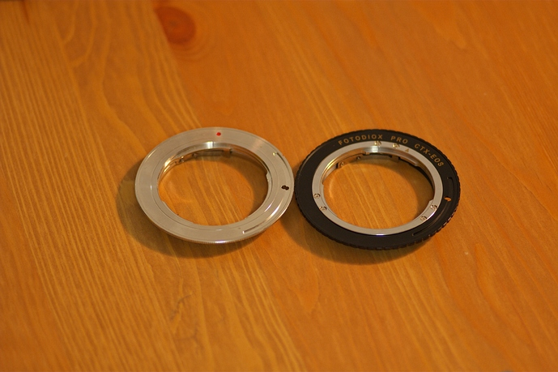
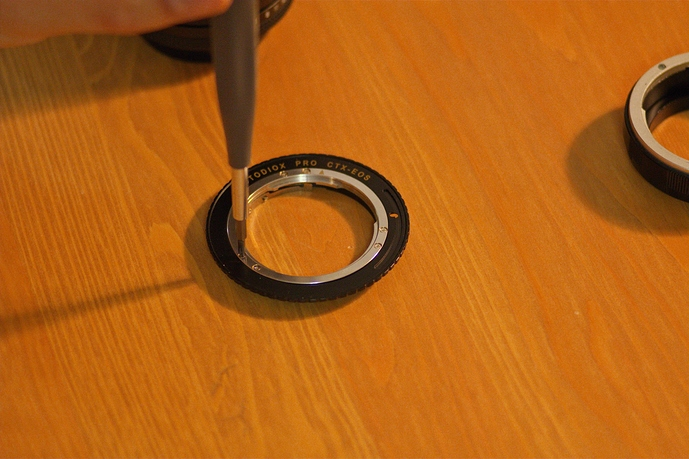
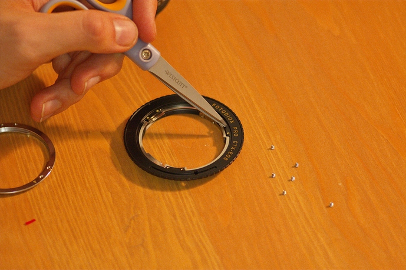
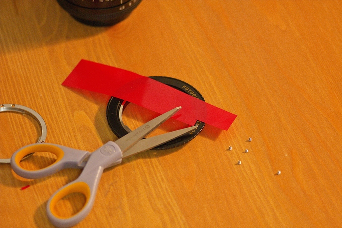
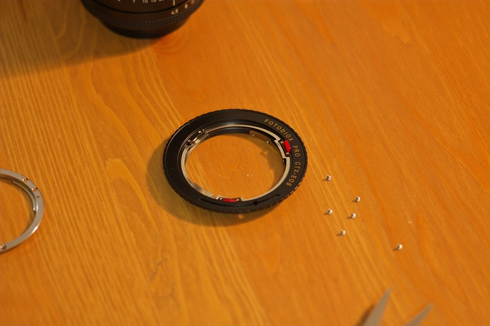
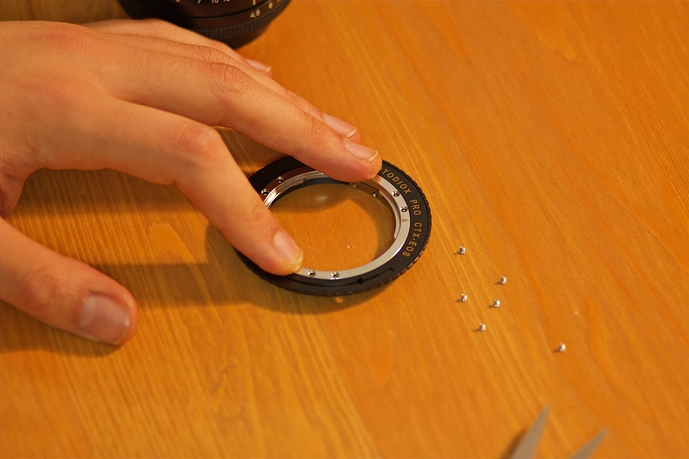

Some of you may know I exclusively use Contax manual focus lenses on my Canon cameras. I have had one reliable adapter from the start, that just happened to be perfect in every way: perfectly parallel, and lets my lenses focus *exactly* to infinity, and none of my lenses hit the mirror on my 5D.

However, swapping adapters between cameras gets mighty tedious, so recently I have been trying a variety of different adapters for my cameras, several quality tiers ranging from the cheapest ($15) up to the most expensive ($70).

<!-- more -->

<figure>

</figure>

However, I wasn't satisfied with any of them. In order to assure that the adapted lenses can focus to infinity even with manufacturing tolerances, they're made thinner than necessary. This means that they focus *past* infinity, and with some lenses the mirror of my 5D would hit the back of the lens, needing me to wiggle it to free the mirror after taking a photo.

<figure>

</figure>

I measured my fancier Fotodiox Pro adapter, and found that not only was it too thin, but it was unevenly thick! The top was 8 thousandths of an inch thin, the bottom right was 2 thousandth of an inch thin, and the bottom left was exactly the right thickness.

I decided I could do something about it.

<figure>

</figure>

I bought some shim stock from McMaster Carr, plastic and 2 thousandths of an inch thick, figuring I might be able to fold it to build up thickness if necessary. (Spoiler: it does fold.) It comes as a giant sheet five by twenty inches, but you'll only need the tiniest amount of it.

<figure>

</figure>

Then I went about removing the screws that hold the two sides together.

<figure>

</figure>

The screws are incredibly small.

<figure>

</figure>

Here you can see that there are only three points on the ring that actually control the thickness; I point to one with the scissors. I had to be careful when measuring the thickness to only measure it between the screws, and that was challenging because the EF mount diameter is larger than the C/Y mount diameter, and there was only the slightest overlap between the outside of the C/Y registration surface and the inside of the EF mount.

<figure>

</figure>

Next I just cut a narrow strip out of this piece of shim stock using scissors, and put slits in it so it could fold more easily.

<figure>

</figure>

The right hand shim is folded in the shape of a W, and the left hand shim is only one layer.

<figure>

</figure>

The thicker shim went on the top, and the thinner shim went on the bottom-right.

<figure>

</figure>

Put the ring back on, and then...

<figure>

</figure>

Reinstall the screws.

Test your lenses for infinity focus and, if applicable, mirror slap, and rejoice if they're good!

---

If you don't have a perfect adapter as a reference for the proper thickness, you can first adjust the adapter to be perfectly even thickness all the way around, and then you can add thickness uniformly until your lenses just barely focus to infinity. It might be time consuming, but it's very rewarding being able to trust the infinity stop on your lenses.

This method isn't only applicable to the two-part SLR->SLR Fotodiox adapters; it should also work for SLR or rangefinder to mirrorless adapters as well.

I've seen it written that you can't be sure whether or not your adapters are even thickness all the way around, but with this technique, you can *make* sure that your adapters are perfect.

---

_Carlo originally posted this as a thread on the forums but I thought it would be useful as a post.  He has graciously allowed us to re-publish it here. **--Pat**_
