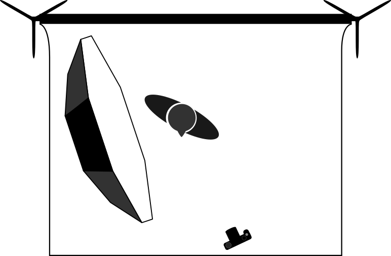
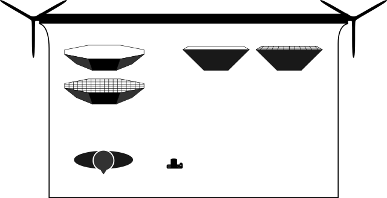

Community member [Eric Mesa][] asked on [the forums][] the other day if there might be some Free resources for photographers that want to build a lighting diagram of their work.  These are the diagrams that show how a shot might be set up with the locations of lights, what types of modifiers might be used, and where the camera/photographer might be positioned with respect to the subject.  These diagrams usually also include lighting power details and notes to help the production.

It turns out there wasn't really anything openly available and permissively licensed.  So we need to fix that...

[Eric Mesa]: http://www.ericsbinaryworld.com/
[the forums]: https://discuss.pixls.us/t/is-there-a-good-lighting-setup-template-for-gimp/1179/

<!-- more -->

These diagrams are particularly handy for planning a shoot conceptually or explaining what the lighting setup was to someone after the fact.  For instance, here's a look at the lighting setup for [Sarah (Glance)][sarah]:

[sarah]: https://www.flickr.com/photos/patdavid/14297966412

<figure>

<figcaption>
Sarah (Glance)
</figcaption>
</figure>

<figure>

<figcaption>
YN560 full power into a 60" Photek Softlighter, about 20" from subject. 
She was actually a bit further from the rear wall...
</figcaption>
</figure>

There are a few different commercial or restrictive-licensed options for photographers to create a lighting diagram, but nothing truly [Free][].

So thanks to the prodding by Eric, I thought it was something we should work on as a community!

I already had a couple of simple, basic shapes created in [Inkscape][] for another tutorial so I figured I could at least get those files published for everyone to use.

I don't have much to start with but that shouldn't be a problem!  I already had a backdrop, person, camera, octabox (+grid), and a softbox (+grid):

<figure>

</figure>

## PIXLS.US Github Organization

I already have a [GitHub organization][github] setup just for PIXLS.US, you can find the lighting-diagram assets there:

https://github.com/pixlsus/pixls-lighting-diagram

Feel free to join the organization!

Even better: join the organization and fork the repo to add your own additions and to help us flesh out the available diagram assets for all to use!
From the README.md on that repo, I compiled a list of things I thought might be helpful to create:

* Cameras
    * DSLR
    * Mirrorless
    * MF
* Strobes
    * Speedlight
    * Monoblock
* Lighting Modifiers
    * Softbox (+ grid?)
    * Umbrella (+ grid?)
    * Octabox (+ grid?)
    * Brolly
* Reflectors
* Flags
* Barn Doors / Gobo
* Light stands? (C-Stands?)
* Environmental
    * Chairs
    * Stools
    * Boxes
    * Backgrounds (+ stands)
* Models

If you don't want to create something from scratch, perhaps grabbing the files and tweaking the existing assets to make them better in some way?

Hopefully we can fill out the list fairly quickly (as it's a fairly limited subset of required shapes).  Even better would be if someone picked up the momentum to possibly create a nice lighting diagram application of some sort!

The files that are there now are all license [Creative Commons By-Attribution, Share-Alike 4.0](https://creativecommons.org/licenses/by-sa/4.0/).

[Free]: http://www.gnu.org/philosophy/free-sw.en.html
[Inkscape]: https://inkscape.org
[GitHub]: https://github.com/pixlsus

