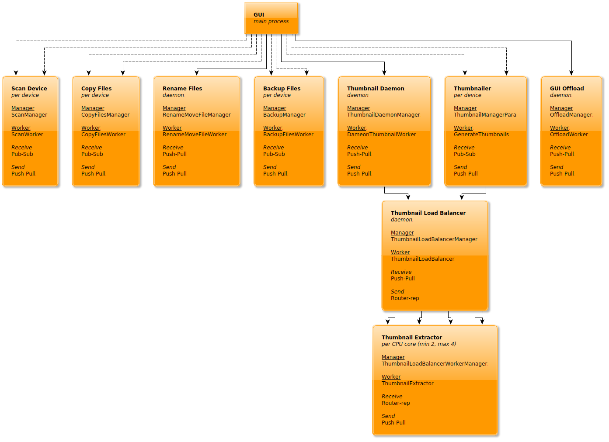
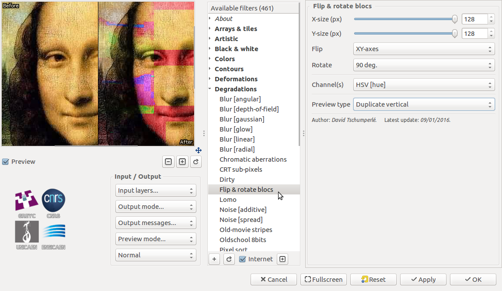
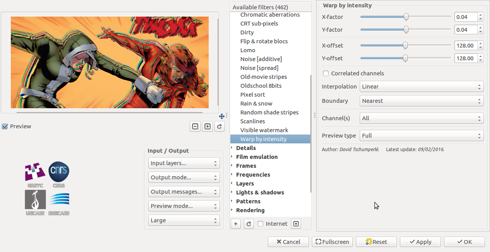

Welcome to the first installment of *From the Community*, a (hopefully) quarterly blog post to highlight a few of the things our community members have been doing!

<!-- more -->

## Rapid Photo Downloader Process Model

[@damonlynch has a great write up of Rapid Photo Download's process model](https://discuss.pixls.us/t/the-rapid-photo-downloader-0-9-process-model/2114). Rapid Photo Downloader is built using [Python][], so if you're looking for a good way to add threads to your Python program, this write up has some good information for you, check it out!

<figure class='big-vid'>
    
</figure>

[Python]: https://www.python.org/

## Community-built Software downloads page

Free Software development tends to move at a pretty good pace, so there is always something new to try out! Not all of the new things warrant a new release, but our community steps up and builds the software so that others can use and test! Instead of random links to dropboxes and such, we've created a [Community-built Software page](https://discuss.pixls.us/t/community-built-software/2137) to help centralize and make it easy for our users to help find and download the freshest builds of software from our great community members. Keep in mind that support may be limited for these builds and they're considered testing, so quality may vary, but if you covet the newest, shiniest things, this is the place for you!

## Glitch art filters coming to G'MIC

[G'MIC will be getting some cool glitch art filters in 1.7.6](https://discuss.pixls.us/t/on-the-road-to-1-7-6/2167). [@thething][] is interested in [glitch art](https://en.wikipedia.org/wiki/Glitch_art) and [requested some new filters in G'MIC](https://discuss.pixls.us/t/glitch-art-filters/2159), and [@David_Tschumperle][] delivered very quickly!

You can flip blocks:

<figure class='big-vid'>
    
</figure>

and warp your images:

<figure class='big-vid'>
    
</figure>

## An Alternative to Watermarking

Watermarking is ugly and takes focus away from your image. [Why not try and add an attribution bar to your images?](https://discuss.pixls.us/t/annotation-with-imagemagick-watermark-ish/1813) In this post, [@patdavid][] lays out how to add a bar underneath your image with your name, the image title, and a little logo. [@David_Tschumperle][] followed that effort up with an alternate implementation using G'MIC instead of imagemagic. Lastly, [@vato][] rolled the imagemagick version into a [bash script](https://discuss.pixls.us/t/annotation-with-imagemagick-watermark-ish/1813/6) with the necessary parameters exposed as variables at the beginning of the script.

Here is an example image by [@Morgan_Hardwood][]:

<figure class='big-vid'>
    
</figure>

## Help Author a Tutorial for Beginners

Finally, [we're still working on our beginner article](https://discuss.pixls.us/t/article-idea-beginners-intro-to-free-software-photography/931) to help new users navigate the myriad of free software photography software that is out there. If you have ideas, or better yet, want to author a bit of content with our community, please join and help out! The post is community wiki and has complete revision control, so don't be afraid to jump in and contribute!

[@David_Tschumperle]: https://discuss.pixls.us/users/david_tschumperle
[@patdavid]: https://discuss.pixls.us/users/patdavid
[@vato]: https://discuss.pixls.us/users/vato
[@Morgan_Hardwood]: https://discuss.pixls.us/users/morgan_hardwood
[@thething]: https://discuss.pixls.us/users/thething
