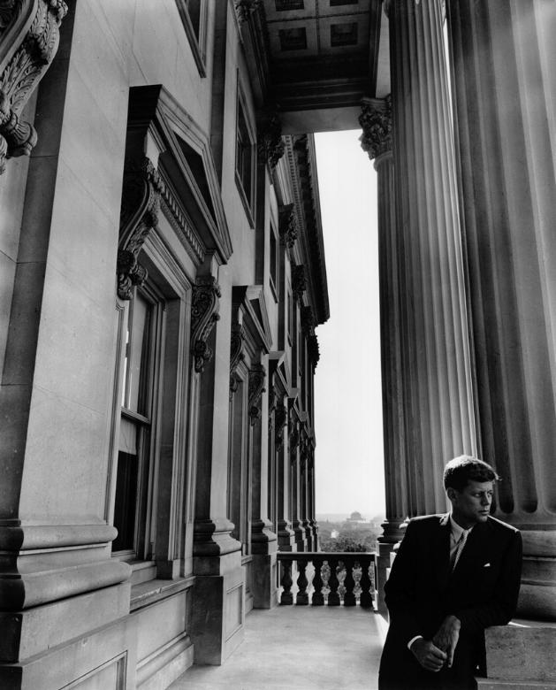
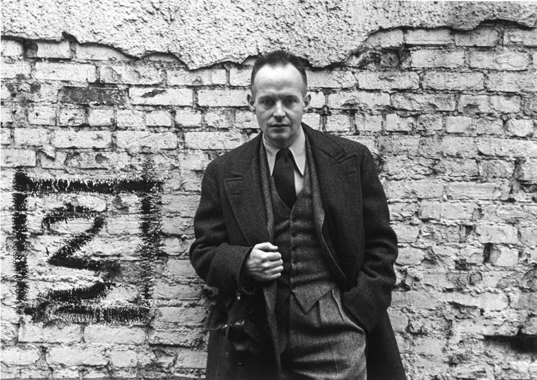

Anyone that has spent any time around me would soon realize that I'm particularly fond of portraits.  I've had the pleasure of being able to shoot the darktable folks back in 2014 at LGM in Leipzig as well as my GIMP compatriots in both 2014 and 2016 Libre Graphics Meetings. So I thought it would be fun to take a look at the "father" of environmental portraits - Arnold Newman.

<!-- more -->

<!-- 
[darktable II image]
<figure>

</figure>
-->

Newman wanted to become a painter before needing to drop out of college after only two years to take a job shooting portraits in a photo studio in Philadelphia. This experience apparently taught him what he did _not_ want to do with photography...

Luckily it may have started defining what he _did_ want to do with his photography. Namely, his approach to capturing his subjects alongside (or within) the context of the things that made them notable in some way.  This would became known as "Environmental Portraiture". He described it best in an interview for [American Photo][1] in 2000:

> I didn't just want to make a photograph with some things in the background.  The surroundings had to add to the composition and the understanding of the person.  No matter who the subject was, it had to be an interesting photograph.  Just to simply do a portrait of a famous person doesn't mean a thing. [1][]

Though he has felt that the term might be unnecessarily restrictive (and possibly overshadows his other pursuits including abstractions and photojournalism), there's no denying the impact of the results. Possibly his most famous portrait, of composer Igor Stravinsky, illustrates this wonderfully.  The overall tones are almost monotone (flat - pun intended, and likely intentional on behalf of Newman) and are dominated by the stark duality of the white wall with the black piano.

<figure>

<figcaption>
_Igor Stravinsky, New York, NY, 1946_ by [Arnold Newman][newman]
</figcaption>
</figure>

Newman realized that the open lid of the piano _"...is like the shape of a musical flat symbol&mdash;strong, linear, and beautiful, just like Stravinsky's work."_ [1][] The geometric construction of the image instantly captures the eye and the aggressive crop makes the final composition even more interesting. In this case the crop was a fundamental part of the original composition as shot, but it was not uncommon for him to find new life in images with different crops.

In a similar theme his portraits of both [Salador Dalí][dali] and [John F. Kennedy][kennedy] show a willingness to allow the crop to bring in different defining characteristics of his subjects. In the case of Dalí it allows one of (presumably) his sketches to hang there abstracting and mimicking the pose of the artist himself. Kennedy is mostly the only organic form dwarfed by the imposing architecture and hard lines surrounding him (perhaps an indication of the gravity and weight of the office for the young Senator).

<figure>

<figcaption>
(top) Salvador Dali, New York, NY, 1951 by [Arnold Newman][newman]  
(bottom) John F. Kennedy, Washington D.C., 1953 by [Arnold Newman][newman]
</figcaption>
</figure>

He manages to bring the same deft handling of placing his subjects in the context of their work with other photographers as well.  His portrait of [Ansel Adams][adams] shows the photographer just outside his studio with the surrounding wilderness not only visible around the frame but reflected in the glass of the doors behind him (and the photographers glasses). Perhaps an indication of the nature of Adams work being to capture natural scenes through glass?

<figure>

<figcaption>
Ansel Adams, 1975 by [Arnold Newman][newman]
</figcaption>
</figure>

For anyone familiar with the pioneer of another form of photography, Newman's portrait of (the usually camera shy) [Henri Cartier-Bresson][bresson] will instantly evoke a sense of the artists candid street images.  In it, Bresson appears to take the place of one of his subjects caught briefly on the streets in a fleeting moment. The portrait has an almost spontaneous feeling to it, (again) mirroring the style of the work of its subject.

<figure>

<figcaption>
Henri Cartier-Bresson, New York, NY, 1947 by [Arnold Newman][newman]
</figcaption>
</figure>

The eloquent [Gregory Heisler][heisler] had a wonderful discussion about Newman for [_Atlanta Celebrates Photography_][acp] at the High Musuem in 2008:

<iframe width="640" height="360" src="https://www.youtube-nocookie.com/embed/IjY8XbGXmXw" frameborder="0" allowfullscreen></iframe>

Arnold Newman produced an amazing body of work 

> But a lot of photographers think that if they buy a better camera they'll be able to take better photographs.  A better camera won't do a thing for you if you don't have anything in your head or in your heart. [1][]

<small>
1 Harris, Mark. ["Arnold Newman: The Stories Behind Some of the Most Famous Portraits of the 20th Century."][1] _American Photo_, March/April 2000, pp. 36-38
</small>

[newman]: http://arnoldnewman.com/
[dali]: https://en.wikipedia.org/wiki/Salvador_Dal%C3%AD
[kennedy]: https://en.wikipedia.org/wiki/John_F._Kennedy
[adams]: http://anseladams.com/
[bresson]: https://en.wikipedia.org/wiki/Henri_Cartier-Bresson 
[heisler]: https://en.wikipedia.org/wiki/Gregory_Heisler
[acp]: http://www.acpinfo.org/blog/2008/09/29/gregory-heisler-on-arnold-newman-the-man-and-his-impact-wednesday-oct-1st-7pm-the-high-museum/

[1]: https://books.google.com/books?id=qWOpWDKpUjgC&pg=PA36#v=onepage&q&f=true

