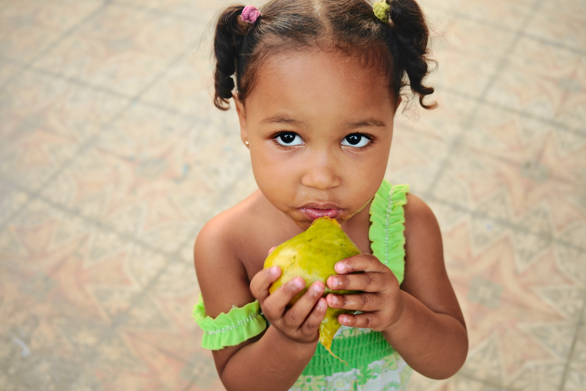
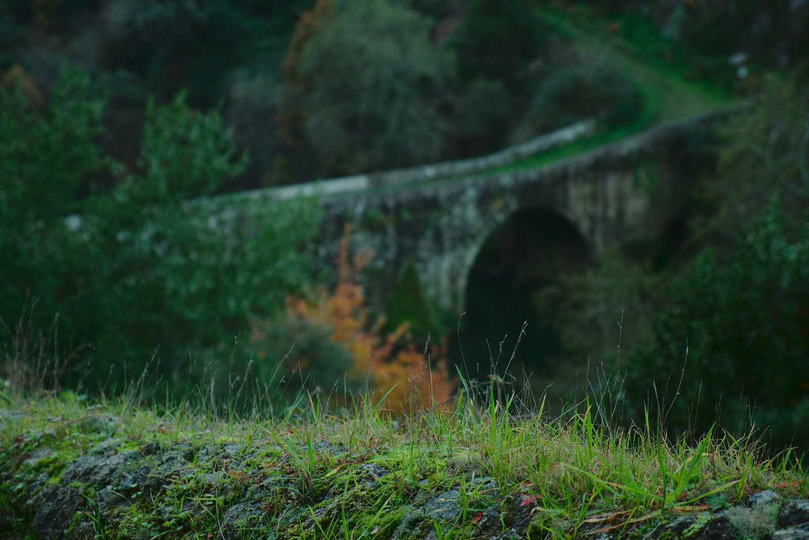

I realize that I'm a little late to this, but photographer [João Almeida][joao] has created a wonderful set of film emulation presets for [darktable][] that he uses in his own workflow for personal and commisioned work. Even more wonderful is that he has graciously [released them for everyone to use][joao-emu].

<!-- more -->

These film emulations started as a personal side project for João, and he adds a disclaimer to them that he did not optimize them all for each brand or model of his cameras.  His end goal was for these to be as simple as possible by using a few [darktable][] modules. He describes it best on [his blog post about them][joao-emu]:

> The end goal of these presets is to be as simple as possible by using few Darktable modules, it works solely by manipulating Lab Tone Curves for color manipulation, black & white films rely heavily on Channel Mixer. Since I what I was aiming for was the color profiles of each film, other traits related with processing, lenses and others are unlikely to be implemented, this includes: grain, vignetting, light leaks, cross-processing, etc.

Some before/after samples from his blog post:

<figure>

<figcaption>
João Portra 400 
(Click to compare to original)
</figcaption>
</figure>

<figure>

<figcaption>
João Kodachrome 64 
(Click to compare to original)
</figcaption>
</figure>

<figure>

<figcaption>
João Velvia 50 
(Click to compare to original)
</figcaption>
</figure>

You can read more on [João's website][joao-emu] and you can see many more [images on Flickr with the #t3mujinpack tag][t3-tag]. The full list of film emulations included with his pack:

* AGFA APX 25, 100
* Fuji Astia 100F
* Fuji Neopan 1600, Acros 100
* Fuji Pro 160C, 400H, 800Z
* Fuji Provia 100F, 400F, 400X
* Fuji Sensia 100
* Fuji Superia 100, 200, 400, 800, 1600, HG 1600
* Fuji Velvia 50, 100
* Ilford Delta 100, 400, 3200
* Ilford FP4 125
* Ilford HP5 Plus 400
* Ilford XP2
* Kodak Ektachrome 100 GX, VS
* Kodak Ektar 100
* Kodak Elite Chrome 400
* Kodak Kodachrome 25, 64, 200
* Kodak Portra 160 NC, VC
* Kodak Portra 400 NC, UC, VC
* Kodak Portra 800
* Kodak T-Max 3200
* Kodak Tri-X 400

If you see João around the forums stop and say hi (and maybe a thank you). Even better, if you find these useful, consider buying him a beer (donation link is on his blog post)!

### Related Reading

* [color manipulation with the colour checker lut module (darktable)](/blog/2016/06/color-manipulation-with-the-colour-checker-lut-module/)
* [Pat David's film emulation LUTs (G'MIC)](http://gmic.eu/film_emulation/)
* [Common Color Curves (Portra, Provia, Velvia) (RawTherapee)](https://discuss.pixls.us/t/common-color-curves-portra-provia-velvia/2154)
* [Pascal's colormatch](https://github.com/pmjdebruijn/colormatch)

[joao]: http://www.joaoalmeidaphotography.com/
[joao-emu]: http://www.joaoalmeidaphotography.com/en/t3mujinpack-film-darktable/
[t3-tag]: https://www.flickr.com/photos/tags/t3mujinpack
[darktable]: http://www.darktable.org/
