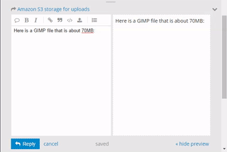

Here in the U.S., we have a big holiday coming up this week: [Thanksgiving][].
Serendipitously, this holiday also happens to fall when a few neat things are happening around the community, and what better time is there to recognize some folks and to give thanks of our own?  _No time like the present!_

<!-- more -->

## A Special Thanks
I feel a special "Thank You" should first go to a photographer and fantastic supporter of the community, [Dimitrios Psychogios][g+].  Last year for our trip to [Libre Graphics Meeting, London][] he stepped up with an awesome donation to help us bring some fun folks together.

<figure class='big-vid'>

<figcaption>
Fun folks together. 
Mairi, the darktable nerds, a RawTherapee nerd, and a PhotoFlow nerd. 
(and the nerd taking the photo, patdavid)
</figcaption>
</figure>

This year he was incredibly kind by offering a donation to the community (completely unsolicited) that covers our hosting and infrastructure costs for an entire year!  So on behalf of the community, **Thank You for your support, Dimitrios**!

I'll be creating a page soon that will list our supporters as a means of showing our gratitude. Speaking of supporters and a new page on the site...

## A Support Page
Someone had asked about the possibility of donating to the community on a post.  We were [talking about providing support][midi] in [darktable][] for using a midi controller deck and the costs for some of the options weren't too extravagant.  This got us thinking that enough small donations could probably cover something like this pretty easily, and if it was community hardware we could make sure it got passed around to each of the projects that would be interested in creating support for it.

<figure>

<figcaption>
An example midi-controller that we might get support   
for in darktable and other projects.
</figcaption>
</figure>

That conversation had me thinking about ways to allow folks to support the community.  In particular, ways to make it easy to provide support on an on-going basis if possible (in addition to simple, single donations).  There are goal-oriented options out there that folks are probably already familiar with (Kickstarter, Indiegogo and others) but the model for us is less goal-oriented and more about continuous support. 

Patreon was an option as well (and I already had a skeleton Patreon account set up), but the fees were just too much in the end.  They wanted a flat 5% along with the regular PayPal fees.  The general consensus among the staff was that we wanted to maximize the funds getting to the community.

The best option in the end was to create a merchant account on PayPal and manually set up the various payment options.  I've set them up similar to how a service like Patreon might run with four different _recurring_ funding levels and an option for a single one-time payment of whatever a user would like.  Recurring levels are nice because they make it easier to plan with.

### We're Not Asking
Our requirements for the infrastructure of the site are modest and we haven't actively pursued support or donations for the site before.  _That hasn't changed._

We're not asking for support now.  The _best_ way that someone can help the community is by _being an active part of it._

> Engaging others, sharing what you've done or learned, and helping other users out wherever you can. This is the best way to support the community.

I purposely didn't talk about funding before because I don't want folks to have to worry or think about it.  And before you ask: no, we are not and will not run any advertising on the site. I'd honestly rather just keep paying for things out of my pocket instead.

We're not asking for support, _but we'll accept it_.

With that being said, I understand that there's still some folks that would like to contribute to the infrastructure or help us to get hardware to add support in projects and more.  So if you do want to contribute, the page for doing so can be found here:

https://pixls.us/support

There are four recurring funding levels of $1, $3, $5, and $10 per month.
There is also a one-time contribution option as well.

We also have an [Amazon Affiliate][] link option.  If you're not familiar with it, you simply click the link to go to Amazon.com.  Then anything you buy for the next 24 hours will give us some small percentage of your purchase price.  It doesn't affect the price of what you're buying at all. So if you were going to purchase something from Amazon anyway, and don't mind - then by all means use our link first to help out!

* * *

## 1000 Users
This week we also finally hit 1,000 users registered on [discuss][]! Which is just bananas to me.  I am super thankful for each and every member of the community that has taken the time to participate, share, and generally make one of the better parts of my day catching up on what's been going on.  You all rock!

<iframe width="560" height="315" src="https://www.youtube.com/embed/StTqXEQ2l-Y" frameborder="0" allowfullscreen></iframe>

While we're talking about a number "1" with bunch of zeros after it, we recently made some neat improvements to the forums...

## 100 Megabytes
We are a photography community and it seemed stupid to have to restrict users from uploading full quality images or raw files.  Previously it was a concern because the server the forums are hosted on have limited disk space (40GB).  Luckily, [Discourse][] has an option for storing all uploads to the forum on [Amazon S3][] buckets.

I went ahead and created some S3 buckets so that any uploads to the forums will now be hosted on Amazon instead of taking up precious space on the server. The costs are quite reasonable (around $0.30/GB right now), and it also means that I've been able to bump the upload size to 100MB for forum posts! You can now just drag and drop full resolution raw files directly into the post editor to include the file!

<figure>

<figcaption>
70MB GIMP .xcf file?  Just drag-and-drop to upload, no problem! :)
</figcaption>
</figure>

## Travis CI Automation
On a slightly geekier note, did you know that the code for the entire website is available on [Github][pixlsgit]?  It's also licensed liberally ([CC-BY-SA][]), so no reason not to come and fiddle with things with us!  One of the features of using Github is integration with [Travis CI][] (Continuous Integration).

What this basically means is that every commit to the Github repo for the website gets picked up by Travis and built to test that everything is working ok.  You can actually see the [history of the website builds][] there.

I've now got it set up so that when a build is successful on Travis, it will automatically publish the results to the main webserver and make it live. Our build system, [Metalsmith][], is a static site generator.  This means that we build the entire website on our local computers when we make changes, and then publish all of those changes to the webserver.  This change automates that process for us now by handling the building and publishing if everything is ok.

In fact, if everything is working the way I _think_ it should, this very blog post will be the first one published using the new automated system!  Hooray!

You can poke me or @paperdigits on discuss if you want more details or feel like playing with the website.

## Mica
Speaking of @paperdigits, I want to close this blog post with a great big "**Thank You!**" to him as well. He's the only other person insane enough to try and make sense of all the stuff I've done building the site so far, and he's been extremely helpful hacking at the website code, writing articles, make good infrastructure suggestions, taking the initiative on things (t-shirts and github repos), and generally being awesome all around.

[Thanksgiving]:https://en.wikipedia.org/wiki/Thanksgiving_(United_States) 
[g+]: https://plus.google.com/+DimitriosPsychogios
[Libre Graphics Meeting, London]: https://pixls.us/blog/2016/01/libre-graphics-meeting-london/
[darktable]: http://www.darktable.org
[midi]: https://discuss.pixls.us/t/midi-controller-for-darktable/2582
[discuss]: https://discuss.pixls.us
[Amazon Affiliate]: https://www.amazon.com//ref=as_li_ss_tl?ref_=nav_custrec_signin&&linkCode=ll2&tag=pixls.us-20&linkId=418b8960b708accf468db7964fc2d4b5 "Go to Amazon.com using our affiliate link"
[Discourse]: http://www.discourse.org/
[Amazon S3]: https://aws.amazon.com/s3/ 
[pixlsgit]: https://github.com/pixlsus/website
[CC-BY-SA]: https://github.com/pixlsus/website/blob/master/LICENSE
[Travis CI]: https://travis-ci.org
[history of the website builds]: https://travis-ci.org/pixlsus/website/builds
[Metalsmith]: http://www.metalsmith.io/
