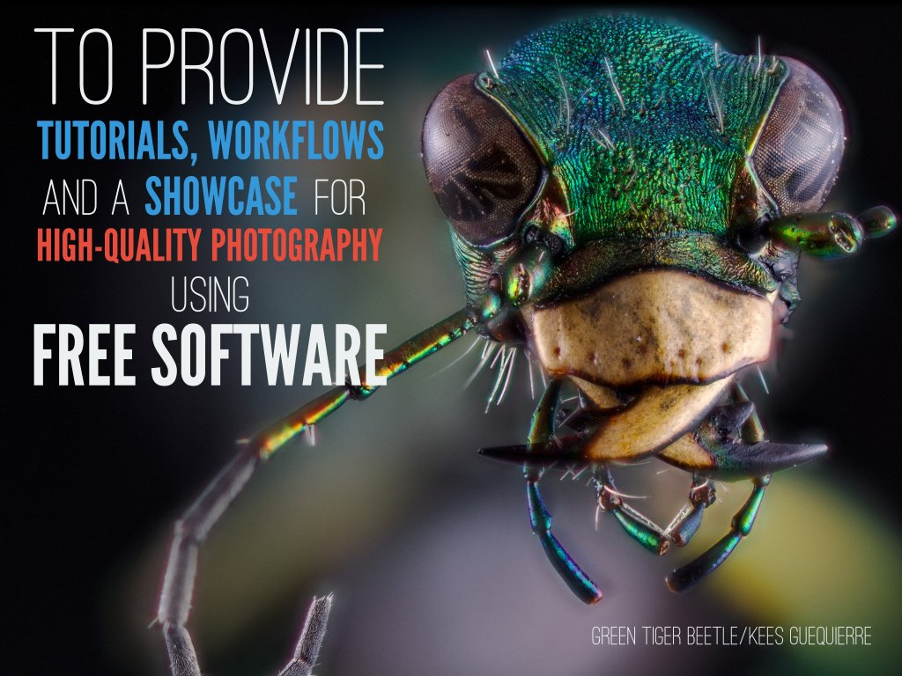

Happy New Year, and I hope everyone has had a wonderful holiday!

We've been busy working on various things ourselves, including migrating [RawPedia][] to a new server as well as building a replacement raw sample database/website to alleviate the problems that [rawsamples.ch][] was having...

[RawPedia]: http://rawpedia.rawtherapee.com
[rawsamples.ch]: http://rawsamples.ch

<!-- more -->

## rawsamples.ch Replacement

[Rawsamples.ch][] is a website with the goal to:

>  ...provide RAW-Files of nearly all available Digitalcameras mainly to software-developers.  [sic]

It was created by Jakob Rohrbach and had been running since March 2007, having amassed over 360 raw files in that time from various manufacturers and cameras. Unfortunately, back in 2016 the site was hit with a SQL-injection that ended up corrupting the database for the [Joomla][] install that hosted the site. To compound the pain, there were no database backups... :(

On the good side, the [PIXLS.US][] community has some dangerous folks with idle hands. Our friendly, neighborhood @andabata ([Kees Guequierre][]) had some time off at the end of the year and a desire to build something. You may know @andabata as the fellow responsible for the super-useful [dtstyle][] website, which is chock full of [darktable][] styles to peruse and download (if you haven't heard of it before &ndash; you're welcome!). He's also my go-to for macro photography and is responsible for this awesome image used on a slide for the [Libre Graphics Meeting][]:

<figure>

</figure>

Luckily, he decided to build a site where contributors could upload sample raw files from their cameras for everyone to use &ndash; particularly developers. We downloaded the archive of the raw files kept at rawsamples.ch to include with files that we already had. The biggest difference between the files from rawsamples.ch and [raw.pixls.us][] is the licensing.  The existing files, and the preference for any new contributions, are licensed as [Creative Commons Zero - Public Domain][] (as opposed to [CC-BY-NC-SA][]).

After some hacking, with input and guidance from [darktable][] developer [Roman Lebedev][], the site was finally ready.
The repository for it can be found on GitHub: [raw.pixls.us repo][].

[Joomla]: https://www.joomla.org/
[Kees Guequierre]:https://www.flickr.com/photos/andabata "andabata's Flickr page"
[dtstyle]: https://dtstyle.net/
[darktable]: http://darktable.org
[Libre Graphics Meeting]: http://libregraphicsmeeting.org/2016/
[Creative Commons Zero - Public Domain]: https://creativecommons.org/publicdomain/zero/1.0/ "Creative Commons Zero - Public Domain"
[Creative Commons Zero]: https://creativecommons.org/publicdomain/zero/1.0/ "Creative Commons Zero - Public Domain"
[CC0]: https://creativecommons.org/publicdomain/zero/1.0/ "Creative Commons Zero - Public Domain"
[CC-BY-NC-SA]: https://creativecommons.org/licenses/by-nc-sa/4.0/ "Creative Commons Attribution-NonCommercial-ShareAlike"
[PIXLS.US]: https://pixls.us
[Roman Lebedev]: https://github.com/LebedevRI
[GitHub organization]: https://github.com/pixlsus
[raw.pixls.us repo]: https://github.com/pixlsus/raw

## [raw.pixls.us][]

The site is now live at https://raw.pixls.us.

You can [look at the submitted files](https://raw.pixls.us#repo) and search/sort through all of them (and download the ones you want).

In addition to browsing the archive, it would be fantastic if you were able to supplement the database by uploading sample images.  Many of the files from the rawsamples.ch archive are licensed [CC-BY-NC-SA][], but we'd rather have the files licensed [Creative Commons Zero - Public Domain][].  CC0 is preferable because if the sample raw files are separated from the database, they can safely be redistributed without attribution. So if you have a camera that is already in the list with the more restrictive license, then please consider uploading a replacement for us!

**We are looking for shots that are:**
* Lens mounted on the camera
* Lens cap off
* In focus
* Properly exposed (not over/under)
* Landscape orientation
* Licensed under the [Creative Commons Zero][]

**We are _not_ looking for:**
* Series of images with different ISO, aperture, shutter, wb, or lighting  
(Even if it's a shot of a color target)
* DNG files created with Adobe DNG Converter

[raw.pixls.us]: https://raw.pixls.us

Please take a moment and see if you can provide samples to help the developers!
