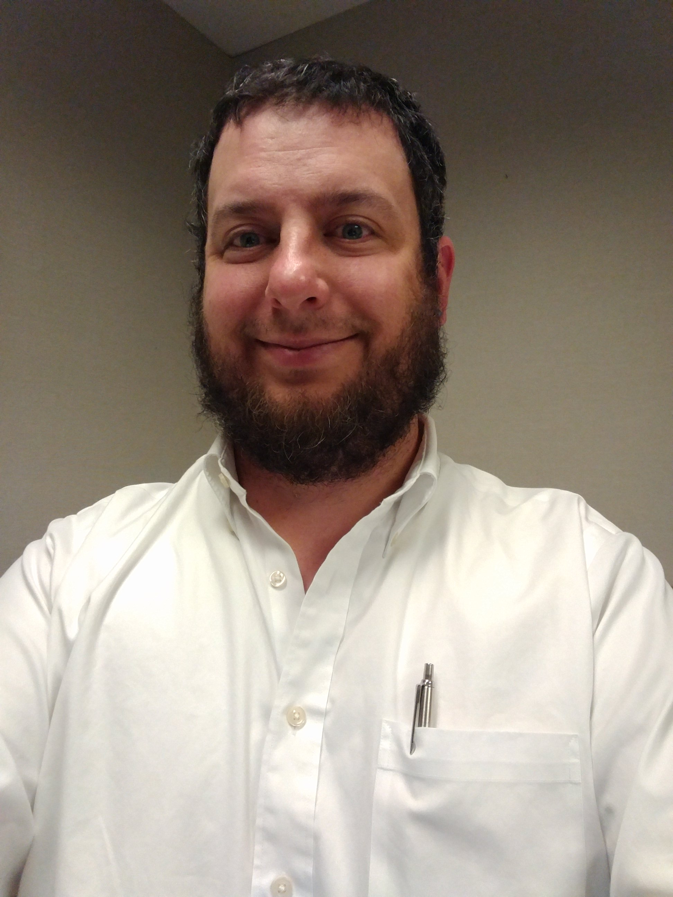

The Southern California Linux Expo (SCaLE) 15x is  returning to the Pasadena Convention Center on March 2-5, 2017. SCaLE is one of the largest community-organized conferences in North America, with some 3,500 attendees last year.

<!-- more -->

If you're attending the conference this year, find me, [@paperdigits](https://discuss.pixls.us/users/paperdigits/activity) and lets talk shop or grab a meal!

<figure>
	
	<caption>Don't judge me, it was the morning.</caption>
</figure>
You can ping me on the [form](https://discuss.pixls.us), [on twitter](https://twitter.com/paperdigits), or on Matrix/riot.im at @paperdigits:matrix.org.

If meeting isn't enough for you, I'll have stickers!

<figure class='big-vid'>
    
</figure>
