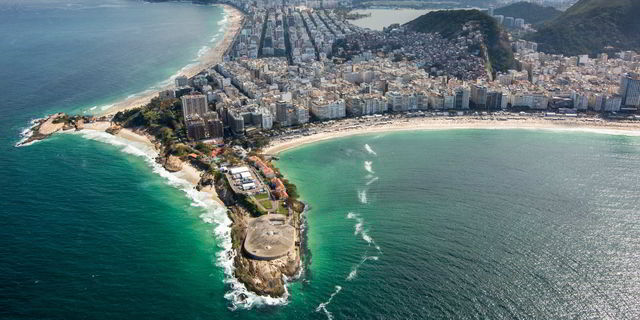
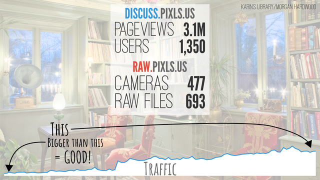
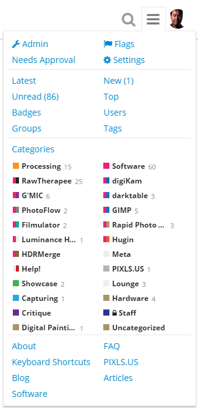

I was idling in our [IRC][] chat room earlier when @Morgan_Hardwood wished us all a "Happy Discuss Anniversary".
Wouldn't you know it, another year slipped right by!
(Surely there's no way it could already be a year [since the last birthday post][1yr]?
Where does the time go?)

<iframe width="560" height="315" src="https://www.youtube-nocookie.com/embed/7YjBImELgOY" frameborder="0" allowfullscreen></iframe>

We've had a bunch of neat things happen in the community over the past year!
Let's look at some of the highlights.

[1yr]: /blog/2016/04/happy-birthday-discuss-pixls-us/

<!--more-->

## Support

I want to start with this topic because it's the perfect opportunity to recognize some folks who have been supporting the community financially...

When I started all of this I decided that I definitely didn't want ads to be on the site anywhere.
I had gotten enough donations from my old blog and [GIMP][] tutorials that I could cover costs for a while entirely from those funds (I also re-did [my personal blog](https://patdavid.net) recently and removed all ads from there as well).

I don't like ads.
You don't like ads.
We're a big enough community that we can keep things going without having to bring those crappy things into our lives.
So to reiterate, we're not going to run ads on the site.

We are hosting the main website on [Stablehost][], the forums ([discuss][]) are on a VPS at [Digital Ocean][], and our file storage for discuss is out on Amazon S3([see below](#amazon-s3)).
All told our costs are about $30 per month.
Not so bad!

### Thank You!

Even so, we have had some folks who have donated to help us offset these costs and I want to take a moment to recognize their generosity and graciousness!

**[Dimitrios Psychogios][]** has been a supporter of the site since the beginning.
This past year he covered (more than) our hosting costs for the entire year, and for that I am infinitely grateful (yes, I have infinite gratitude).
It also helps that based on his postings on G+ our musical tastes are very similarly aligned.
As soon as I get the supporters page up you're going to the top of the list!
*Thank you*, Dimitrios, for your support of the community!

[Dimitrios Psychogios]: https://plus.google.com/+DimitriosPsychogios

**Jonas Wagner** (@Jonas_Wagner) and **McCap** (@McCap) both donated this past year as well.
Which is doubly-awesome because they are both active in the community and have written some great content for everyone as well (@McCap is the author of the article _[A Masashi Wakui look with GIMP][]_, and  has been active in the community since the beginning as well).

[A Masashi Wakui look with GIMP]: https://pixls.us/articles/a-masashi-wakui-look-with-gimp/

**Mica** (@paperdigits) and **Luka** are both *recurring donators* which I am particularly grateful for.
It really helps for planning to know we have some recurring support like that.

I have a bunch of donations where the donators didn't leave me a name to use for attribution and I don't want to just assume it's ok.  If you know you donated and see your first name in the list below (and are ok with me using your full name and a link if you want) then please let me know and I'll update this post (and for the donators page later).

These are the folks who are really making a difference by taking the time and being gracious enough to support us.
Even if you don't want your full name out here, I know who you are and am very, very grateful and humbled by your generosity and kindness.  **Thank you all so much!**

* **Marc W.** (you rock!)
* Ulrich P.
* Luc V.
* Ben E.
* Keith A.
* Philipp H.
* Christian M.
* Matthieu M.
* Christian M.
* Christian K.
* Maria J.
* Kevin P.
* Maciej D.
* Christian K.
* Egbert G.
* Michael H.
* Jörn H.
* Boris H.
* Norman S.
* David O.
* Walfrido C.
* Philip S.
* David S.
* Keith B.
* Andrea V.
* Stephan R.
* David M.
* Bastian H.
* Chance J.
* Luka S.
* Nathanael S.
* Sven K.
* Pepijn V.
* Benjamin W.
* Jörg W.
* Patrick B.
* Joop K.
* Alain V.
* Egor S.
* Samuel S.

On that note.
If anyone wanted to join the folks above in supporting what we're up to, we have a page specifically for that: 

https://pixls.us/support/

Remember, no amount is too small!

## Libre Graphics Meeting Rio

<figure>

<figcaption>
<a title="By Gabriel Heusi/Brasil2016.gov.br (Portal Brasil 2016) [CC BY 3.0 br], via Wikimedia Commons" href="https://commons.wikimedia.org/wiki/File%3AForte_de_Copacabana_panorama.jpg">By Gabriel Heusi/Brasil2016.gov.br</a>
</figcaption>
</figure>

I wasn't able to attend [LGM][] this year, being held down in Rio (but [the GIMP team did][rio]).
That's not to say that we didn't have folks from the community there: Farid (@frd) from [Estúdio Gunga][] was there!

[LGM]: http://libregraphicsmeeting.org/2017/
[rio]: https://pixls.us/blog/2017/03/gimp-is-going-to-lgm/
[Estúdio Gunga]: http://gunga.com.br/

I was able to help coordinate a presentation by Robin Mills (@clanmills) about the state (and future) of [Exiv2][].
They're looking for a maintainer to join the project, as Robin will be stepping down at the end of the year for studies.
If you think you'd be interested in helping out, please get in touch with Robin on the forums and let him know!

[Exiv2]: http://www.exiv2.org/

I also put together (quickly) a few slides on the community that were included in the "State of the Libre Graphics" presentation that kicks off the meeting (presented this year by [GIMP][]er Simon Budig):

[GIMP]: https://www.gimp.org

<figure>

<figcaption>
This slide deck is availabe in our <a href="https://github.com/pixlsus/Presentations/tree/master/LGM2017_State_Of" title="PIXLS.US Github">Github repo</a>.
</figcaption>
</figure>

This was just a short overview of the community and I think it makes sense to include it here was well.
Since we stood the forum up two years ago we've seen about 3.2 million pageviews and have just under 1,400 users in the community.
Which is just _awesome_ to me.

@LebedevRI was also going to be mad if I _didn't_ take the time to at least let folks know about [raw.pixls.us][], where we currently have 693 raw files across 477 cameras.
Please, take a moment to check [raw.pixls.us][] and see if we are missing (or need better) files from a camera you may have, and get us samples for testing!

[raw.pixls.us]: https://raw.pixls.us

## raw.pixls.us

We set up [raw.pixls.us][] so we can gather camera raw samples for regression testing of rawspeed as well to have a place for any other project that might need raw files to test with.
As we [blogged about previously][], the new site is also a replacement for the now defunct rawsamples.ch website.

[blogged about previously]: https://pixls.us/blog/2017/01/new-year-new-raw-samples-website/

Stop in and see if we're missing a sample you can provide, or if you can provide a better (or better licensed) version for your camera.
We're focusing specifically on [CC0](https://creativecommons.org/publicdomain/zero/1.0/) contributions.

## Welcome digiKam!

<figure>

</figure>

As I mentioned in [my last blog post][digi], we learned that the [digiKam][] team was looking for a new webmaster through a post on discuss.
@Andrius posted a heads up on the digiKam 5.5.0 release [in this thread][].

[digi]: https://pixls.us/blog/2017/05/welcome-digikam/
[digiKam]: https://www.digikam.org
[in this thread]: https://discuss.pixls.us/t/digikam-5-5-0-released/3486

Needless to say, less than a month or so later, @paperdigits had already finished up a nice new website for them!
This is something we're really trying to help out the community with and are super glad to be able to help out the digiKam team with this.
The less time they have to worry about web infrastructure and security for it, the more time they can spend on awesome new features for their project and users.

Yes, we used a static site generator ([Hugo][] in this case), and we were also able to move their commenting system to use discuss as its back-end!
This is the same way we're doing comments for PIXLS.US right now (scroll to the bottom of this post).

They've got [their own category][] on discuss for both general digiKam discussion as well as their linked comments from their website.

Speaking of using [discourse][] as a commenting system...

[their own category]: https://discuss.pixls.us/c/software/digikam
[discourse]: http://www.discourse.org/
[Hugo]: http://gohugo.io/

## Discourse upstream

We've been using [discourse][] as our forum software from the beginning.
It's a modern, open, and full-featured forum software that I think works incredibly well as a modern web application.

The ability to embed comments in a website that are part of the forum was one of the main reasons I went with it.
I didn't want to expose users to unnecessary privacy concerns by embedding a third-party commenting system (_cough, [disqus][], cough_).
If I was going to go through the trouble of setting up a way to comment on things, I wanted to homogenize it with a full community-building effort.

[disqus]: https://disqus.com/

This past year they (the discourse devs) added the ability to embed comments in multiple hosts (it was only one host when we first stood things up).
This means that we can now manage the comments for anyone else thay may need them!
Of course, building out a new website for digiKam meant that this was a perfect time to test things.

It all works beautifully, with one minor nitpick.
The ability to _style_ the embedded comments was limited to a single style for all the places that they might be embedded.
This may be fine if all of the sites look similar, but if you visit www.digikam.org and compare it to here, you can see they are a little bit different...
(we're on white, digikam.org is on a dark background).

We needed a way to isolate the styling on a per-host basis, which after much help from @darix (yet _again_ :)) I was able to finally hack something together that worked and get it pushed upstream (and merged finally)!

<figure>

<figcaption>
I made this!
</figcaption>
</figure>

## Play Raw

When [RawTherapee][] migrated their official forums over to pixls they brought something really fun with them: Play Raw.
They would share a single raw file amongst the community and then have everyone process and share their results (including their processing steps and associated .pp3 settings file).

[RawTherapee]: http://rawtherapee.com/

If you haven't seen it yet, we've had quite a few Play Raw posts over the past year with all sorts of wonderful images to practice on and share!
There are portraits, children, dogs, cats, landscapes, HDR, and phở!
There's over 19 different raw files being shared right now, so come try your hand at processing (or even share a file of your own)!

The full list of play_raw posts can always be found here:  
https://discuss.pixls.us/tags/play_raw

## Amazon S3

We _are_ a photography forum, so it only made sense that we made it as easy as possible for community members to upload and share images (raw files, and more).
It's one of the things I love about discourse that it's so easy to add these things to your posts (simply drag-and-drop into the post editor) and upload them.

While this is easy to do, it _does_ mean that we have to store all of this data.
The VPS we use from [Digital Ocean][] only has a 40GB SSD and it has to include all of the main forum running on it.
We did have a little space for a while, but to help alleviate the local storage as a possible problem down the line, I moved our file storage out to Amazon S3.

This means that we can upload all we want and won't really hit a wall with actual available storage space. 
It costs more each month than trying to store it all on local storage for the site, but then we don't have to worry about expansion (or migration) later.
Plus our current upload size limit per file is 100MB!

[Digital Ocean]: https://www.digitalocean.com/

<figure>

</figure>

As you can see, we're only looking at about $5USD/month on average in storage and transfer costs for the site with Amazon.

We're also averaging about $22usd/month in hosting costs with Digital Ocean, so we're still only about $27/month in total hosting costs.
Maybe $30 if we include the hosting for the main website which is at [Stablehost][].

[Stablehost]: https://www.stablehost.com/

## IRC

We've had an [IRC room][] for a long time (longer than [discuss][] I think), but I only just got around to including a link on the site for folks to be able to join through a nice web client ([Kiwi IRC][]).

[IRC room]: https://kiwiirc.com/client/irc.freenode.net/?nick=webuser%7C?#pixls.us
[discuss]: https://discuss.pixls.us
[Kiwi IRC]: https://kiwiirc.com/

<figure>

</figure>

It was included as part of an oft-requested set of links to get back to various parts of the main site from the forums.
I also added these links in the menu for the site as well (the header links are hidden when on mobile, so this way you can still access the links from whatever device you're using):

<figure>

</figure>

If you have your own [IRC client][] then you can reach us on irc.freenode.net #pixls.us.
Come and join us in the chat room!
If you're not there you are definitely missing out on a ton of stimulating conversation and enlightening discussions!

[IRC client]: https://en.wikipedia.org/wiki/Comparison_of_Internet_Relay_Chat_clients
[IRC]:https://kiwiirc.com/client/irc.freenode.net/?nick=webuser%7C?#pixls.us

