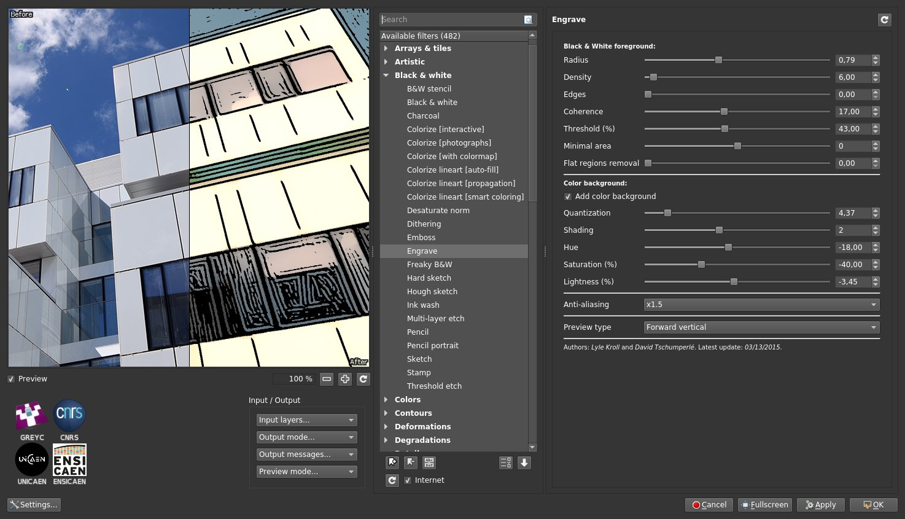
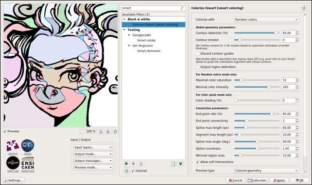
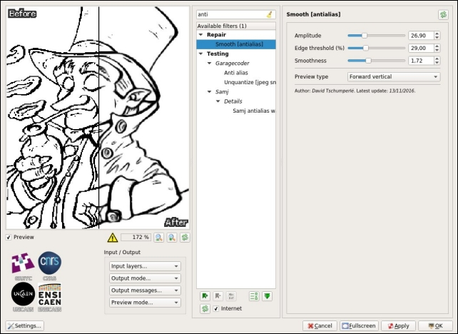
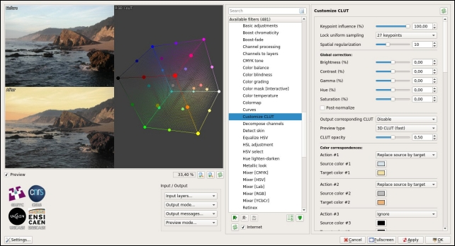
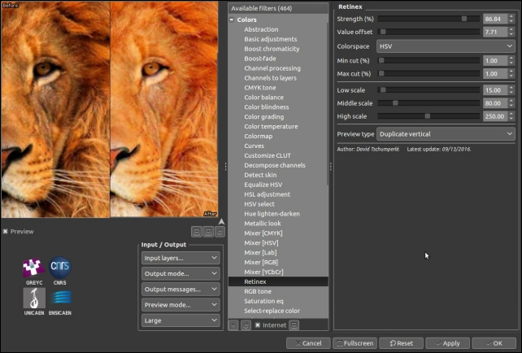
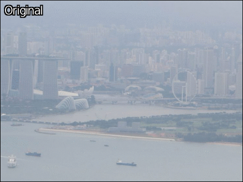
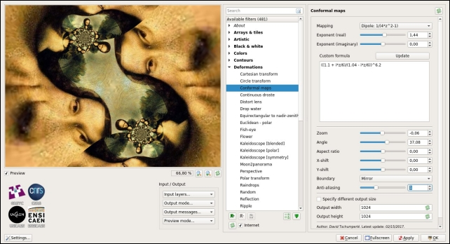
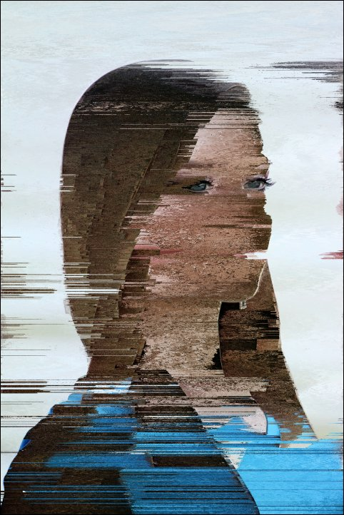
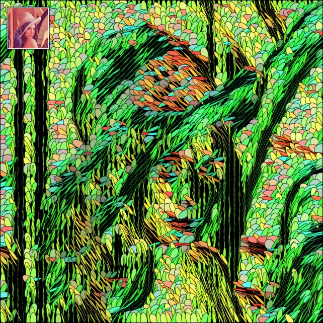
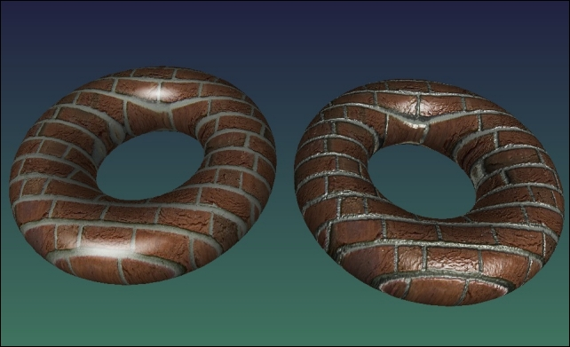

The [_IMAGE_](https://www.greyc.fr/en/image) team of the research laboratory [_GREYC_](https://www.greyc.fr/en) in _Caen_/_France_ is pleased to announce
the release of a new major version (numbered **2.0**) of its project [_G'MIC_](http://gmic.eu): a generic, extensible, and _open source_ framework for
[image processing](https://en.wikipedia.org/wiki/Image_processing).
Here, we present the main advances made in the software since our [last article](https://pixls.us/blog/2016/05/g-mic-1-7-1/).
The new features presented here include the work carried out over the last twelve months (versions _2.0.0_ and _1.7.x_, for _x_ varying from _2_ to _9_).

<!-- more -->

----
Links:
------

* [G'MIC main project page](http://gmic.eu)
* [Twitter feed](https://twitter.com/gmic_ip)
* [G'MIC plug-in for GIMP](http://gmic.eu/gimp.shtml)
* [G’MIC Online web service](https://gmicol.greyc.fr)
* [Changelog for the _2.0.0_ version](https://discuss.pixls.us/t/release-of-gmic-2-0-0)

----

# 1. G'MIC: A brief overview

_G'MIC_ is an open-source project started in August 2008, by the [IMAGE](https://www.greyc.fr/en/image) team.
This French research team specializes in the fields of algorithms and mathematics for image processing.
_G'MIC_ is distributed under the [CeCILL](http://www.cecill.info/licenses/Licence_CeCILL_V2.1-en.txt) license (which is _GPL_ compatible)
and is available for multiple platforms (_GNU/Linux_, _MacOS_ and _Windows_).
It provides a variety of user interfaces for manipulating generic image data, that is to say, _2D_ or _3D_ multispectral images (or sequences)
with floating-point pixel values. This includes, of course, "classic" color images.

<figure>
<a href='logo_gmic.jpg' target='_blank'></a>
<figcaption>
<i>Fig.1.1:</i> Logo of the <i>G'MIC</i> project, an open-source framework for image processing, and its mascot <i>Gmicky</i>.
</figcaption>
</figure>

The popularity of _G'MIC_ mostly comes from the [plug-in](http://gmic.eu/gimp.shtml) it provides for [_GIMP_](http://www.gimp.org) (since 2009).
To date, there are more than _480_ different filters and effects to apply to your images, which considerably enlarges the list of image processing filters
available by default in _GIMP_.

_G'MIC_ also provides a powerful and autonomous [command-line interface](http://gmic.eu/reference.shtml), which is complementary
to the _CLI_ tools you can find in the famous [_ImageMagick_](http://www.imagemagick.org/) or [_GraphicsMagick_](http://www.graphicsmagick.org) projects.
There is also a web service [_G'MIC Online_](https://gmicol.greyc.fr/), allowing to apply image processing effects directly from a browser.
Other (but less well known) _G'MIC_-based interfaces exist: a webcam streaming tool [_ZArt_](https://www.youtube.com/watch?v=k1l3RdvwHeM),
a plug-in for [_Krita_](http://www.krita.org),
a subset of filters available in [_Photoflow_](http://photoflowblog.blogspot.com/2014/10/two-new-photoflow-features-integration.html),
[_Blender_](https://github.com/Starfall-Robles/Blender-2-G-MIC) or [_Natron_](https://github.com/NatronVFX/openfx-gmic/releases)...
All these interfaces are based on the [_CImg_](http://cimg.eu) and [_libgmic_](http://gmic.eu/libgmic.shtml) libraries, that are portable,
thread-safe and multi-threaded, via the use of [_OpenMP_](http://openmp.org/).

_G'MIC_ has more than _950_ different and configurable [processing functions](http://gmic.eu/reference.shtml), for a library of only _6.5Mio_,
representing a bit more than _180 kloc_.
The processing functions cover a wide spectrum of the image processing field, offering algorithms for geometric manipulations, colorimetric changes,
image filtering (denoising and detail enhancement by spectral, variational, non-local methods, etc.), motion estimation and registration,
display of primitives (_2D_ or _3D_ mesh objects), edge detection, object segmentation, artistic rendering, etc.
It is therefore a very generic tool for various uses, useful on the one hand for converting, visualizing and exploring image data,
and on the other hand for designing complex image processing _pipelines_ and algorithms
(see [these project slides](http://gmic.eu/img/gmic_slides.pdf) for details).


# 2. A new versatile interface, based on Qt

One of the major new features of this version **2.0** is the re-implementation of the plug-in code, _from scratch_.
The repository [_G'MIC-Qt_](https://github.com/c-koi/gmic-qt) developed by [Sébastien](https://www.greyc.fr/users/seb) (an experienced member of
the team) is a _Qt_-based version of the plug-in interface, being as independent as possible of the widget _API_ provided by _GIMP_.

<figure>
<a href='gmic_200.jpg' target='_blank'></a>
<figcaption>
<i>Fig.2.1:</i> Overview of version <b>2.0</b> of the <i>G'MIC-Qt</i> plug-in running for <i>GIMP</i>.
</figcaption>
</figure>

This has several interesting consequences:

- The plug-in uses its own widgets (in _Qt_) which makes it possible to have a more flexible and customizable interface than with the _GTK_ widgets
used by the _GIMP_ plug-in _API_: for instance, the preview window becomes resizable at will, manages zooming by mouse wheel, and can be freely moved
to the left or to the right. A filter search engine by keywords has been added, as well as the possibility of choosing between a light
or dark theme. The management of favorite filters has been also improved and the interface even offers a new mode for setting the visibility of the filters.
Interface personalization is now a reality.

- The plug-in also defines its own _API_, which is used to facilitate its integration in third party software (other than _GIMP_).
In practice, a software developer has to write a single file `host_software.cpp` implementing the functions of the _API_ to make the link between the plug-in
and the host application. Currently, the file [`host_gimp.cpp`](https://github.com/c-koi/gmic-qt/blob/master/src/host_gimp.cpp) does this for _GIMP_ as a host.
But there is now also a _stand-alone_ version available (file [`host_none.cpp`](https://github.com/c-koi/gmic-qt/blob/master/src/host_none.cpp) that runs
this _Qt_ interface in solo mode, from a shell (with command `gmic_qt`).

- [Boudewijn Rempt](https://krita.org/en/item/author/boudewijn_rempt/), project manager and developer of the marvelous painting software [_Krita_](http://www.krita.org),
has also started writing such a file [`host_krita.cpp`](https://github.com/c-koi/gmic-qt/blob/master/src/host_krita.cpp) to make this "new generation" plug-in
communicate with _Krita_. In the long term, this should replace the previous _G'MIC_ plug-in implementation they made (currently distributed with _Krita_),
which is aging and poses maintenance problems for developers.

Minimizing the integration effort for developers, sharing the _G'MIC_ plug-in code between different applications, and offering a user interface that is
as comfortable as possible, have been the main objectives of this complete redesign. As you can imagine, this rewriting required a long and sustained effort,
and we can only hope that this will raise interest among other software developers, where having a consistent set of image processing filters
could be useful (a file `host_blender.cpp` available soon ? We can dream!). The animation below illustrates some of the features
offered by this new _Qt_-based interface.

<figure>
<a href='gmic_qt.gif' target='_blank'></a>
<figcaption>
<i>Fig.2.2:</i> The new <i>G'MIC-Qt</i> interface in action.
</figcaption>
</figure>

Note that the old plug-in code written in [_GTK_](https://www.gtk.org/) was updated also to work with the new version **2.0** of _G'MIC_,
but has fewer features and probably will not evolve anymore in the future, unlike the _Qt_ version.


# 3. Easing the work of cartoonists...


One of _G'MIC's_ purposes is to offer more filters and functions to process images.
And that is precisely something where we have not relaxed our efforts, despite the number of filters already available in the previous versions!

In particular, this version comes with new and improved filters to ease the colorization of line-art. Indeed, we had the chance to host the artist
[David Revoy](https://www.davidrevoy.com/) for a few days at the lab. _David_ is well known to lovers of art and free software by his multiple contributions
in these fields (in particular, his web comic [_Pepper & Carrot_](https://www.peppercarrot.com/) is a must-read!).
In collaboration with _David_, we worked on the design of an original automatic line-art coloring filter, named
[**Smart Coloring**](http://www.davidrevoy.com/article324/smart-coloring-preview-of-a-new-gmic-filter).

<figure>
<a href='gmic_smart_coloring.jpg' target='_blank'></a>
<figcaption>
<i>Fig.3.1:</i> Use of the "<b>Colorize line-art [smart coloring]</b>" filter in <i>G'MIC</i>.
</figcaption>
</figure>

When drawing comics, the colorization of line-art is carried out in two successive steps:
The original drawing in gray levels (_Fig.3.2.[1]_) is first pre-colored with solid areas, i.e. by assigning a unique color to each region or distinct object
in the drawing (_Fig.3.2.[3]_). In a second step, the colourist reworks this pre-coloring, adding shadows, lights and modifying the colorimetric ambiance,
in order to obtain the final colorization result (_Fig.3.2.[4]_).
Practically, flat coloring results in the creation of a new layer that contains only piecewise constant color zones, thus forming a colored partition of the plane.
This layer is then merged with the original line-art to get the colored rendering (merging both in _multiplication_ mode, typically).

<figure>
<a href='teaser.jpg' target='_blank'></a>
<figcaption>
<i>Fig.3.2:</i> The different steps of a line-art coloring process (source: <i>David Revoy</i>).
</figcaption>
</figure>

Artists admit it themselves: flat coloring is a long and tedious process, requiring patience and precision.
Classical tools available in digital painting or image editing software do not make this task easy.
For example, even most filling tools (_bucket fill_) do not handle discontinuities in drawn lines very well (_Fig.3.3.a_),
and even worse when lines are anti-aliased.
It is then common for the artist to perform flat coloring by painting the colors manually with a brush on a separate layer (_Fig.3.3.b_),
with all the precision problems that this supposes (especially around the contour lines, _Fig.3.3.c_).
See also [this link](http://www.davidrevoy.com/article240/gmic-line-art-colorization) for more details.

<figure>
<a href='problemes2.jpg' target='_blank'></a>
<figcaption>
<i>Fig.3.3:</i> Classical problems encountered when doing flat coloring (source: <i>David Revoy</i>).
</figcaption>
</figure>

It may even happen that the artist decides to explicitly constrain his style of drawing, for instance by using aliased brushes in a higher resolution image,
and/or by forcing himself to draw only connected contours, in order to ease the flat colorization work that has to be done afterwards.

The **Smart Coloring** filter developed in version **2.0** of _G'MIC_ allows to automatically pre-color an input line-art without much work.
First, it analyses the local geometry of the contour lines (estimating their normals and curvatures).
Second, it (virtually) does contour auto-completion using [_spline curves_](https://en.wikipedia.org/wiki/Spline_(mathematics)).
This virtual closure allows then the algorithm to fill objects with disconnected contour plots.
Besides, this filter has the advantage of being quite fast to compute and gives coloring results of similar quality to more expensive optimization techniques
used in some proprietary software.
This algorithm smoothly manages anti-aliased contour lines, and has two modes of colorization:
by random colors (_Fig.3.2.[2]_ and _Fig.3.4_) or guided by color markers placed beforehand by the user (_Fig.3.5_).

<figure>
<a href='rain.gif' target='_blank'></a>
<figcaption>
<i>Fig.3.4:</i> Using the <i>G'MIC</i> "<b>Smart Coloring</b>" filter in random color mode, for line-art colorization (source: <i>David Revoy</i>).
</figcaption>
</figure>

In "random" mode, the filter generates a piecewise constant layer that is very easy to recolor with correct hues afterwards.
This layer indeed contains only flat color regions, and the classic bucket fill tool is effective here to quickly reassign a coherent color
to each existing region synthesized by the algorithm.

In the user-guided markers mode, color spots placed by the user are extrapolated in such a way that it respects the geometry of the original drawing as much as possible,
taking into account the discontinuities in the pencil lines, as this is clearly illustrated by the figure below:

<figure>
<a href='girl_colorization.gif' target='_blank'></a>
<figcaption>
<i>Fig.3.5:</i> Using the <i>G'MIC</i> "<b>Smart Coloring</b>" filter in user-guided color markers mode, for line-art colorization (source: <i>David Revoy</i>).
</figcaption>
</figure>

This innovative, flat coloring algorithm has been pre-published on _HAL_ (in French):
[_A semi-guided high-performance flat coloring algorithm for line-arts_](https://hal.archives-ouvertes.fr/hal-01490269).
Curious people could find there all the technical details of the algorithm used.
The recurring discussions we had with _David Revoy_ on the development of this filter enabled us to improve the algorithm step by step,
until it became really usable in production. This method has been used successfully (and therefore validated) for the pre-colorization
of the whole [episode 22](https://www.peppercarrot.com/en/article412/episode-22-the-voting-system) of the webcomic _Pepper & Carrot_.

The wisest of you know that _G'MIC_ already had a [line-art colorization filter](http://www.davidrevoy.com/article240/gmic-line-art-colorization)!
True, but unfortunately it did not manage disconnected contour lines so well (such as the example in _Fig.3.5_),
and could then require the user to place a large number of color spots to guide the algorithm properly.
In practice, the performance of the new flat coloring algorithm is far superior.

And since it does not see any objection to anti-aliased lines, why not create ones?
That is the purpose of another new filter "**Repair / Smooth [antialias]**" able to add anti-aliasing
to lines in cartoons that would have been originally drawn with aliased brushes.

<figure>
<a href='s_gmic_antialiasing.jpg' target='_blank'></a>
<figcaption>
<i>Fig.3.6:</i> Filter "<b>Smooth [antialias]</b>" smooths contours to reduce aliasing effect in cartoons (source: <i>David Revoy</i>).
</figcaption>
</figure>

# 4. ...Not to forget the photographers!


_"Colorizing drawings is nice, but my photos are already in color!"_, kindly remarks the impatient photographer. Don't be cruel!
Many new filters related to the transformation and enhancement of photos have been also added in _G'MIC_ **2.0**. Let's take a quick look of what we have.

## 4.1. _CLUTs_ and colorimetric transformations
[_CLUTs_](http://www.quelsolaar.com/technology/clut.html) (_Color Lookup Tables_) are functions for colorimetric transformations defined in the _RGB_ cube:
for each color _(Rs,Gs,Bs)_ of a source image _Is_, a _CLUT_ assigns a new color _(Rd,Gd,Bd)_ transferred to the destination image _Id_
at the same position. These processing functions may be truly arbitrary, thus very different effects can be obtained according to the different _CLUTs_ used.
Photographers are therefore generally fond of them (especially since these _CLUTs_ are also a good way to simulate the color rendering of certain old films).

In practice, a _CLUT_ is stored as a _3D_ volumetric color image (possibly "unwrapped" along the _z = B_ axis to get
a [_2D_ version](http://gmic.eu/film_emulation/various/clut/golden.png)).
This may quickly become cumbersome when several hundreds of _CLUTs_ have to be managed.
Fortunately, _G'MIC_ has a quite efficient _CLUT_ compression algorithm (already mentioned in a [previous article](https://pixls.us/blog/2016/05/g-mic-1-7-1)),
which has been improved version after version. So it was finally in a quite relax atmosphere that we added more than **60** new _CLUT_-based transformations in _G'MIC_,
for a total of **359** _CLUTs_ usable, all stored in a data file that does exceed _1.2 Mio_.
By the way, let us thank
[Pat David](https://patdavid.net/),
[Marc Roovers](http://www.digicrea.be/haldclut-set-style-a-la-nik-software) and
[Stuart Sowerby](http://blog.sowerby.me/fuji-Film-simulation-profiles/) for their contributions to these color transformations.

<figure>
<a href='a891743705fd011bebe68b1f88e2f0b90fddbdb1.jpg' target='_blank'></a>
<figcaption>
<i>Fig.4.1.1:</i> Some of the new <i>CLUT</i>-based transformations available in <i>G'MIC</i> (source: <i>Pat David</i>).
</figcaption>
</figure>

But what if you already have your own _CLUT_ files and want to use them in _GIMP_? No problem !
The new filter "**Film emulation / User-defined**" allows to apply such transformations from _CLUT_ data file, with a partial support of files with
extension `.cube` ([_CLUT_ file format](http://wwwimages.adobe.com/content/dam/Adobe/en/products/speedgrade/cc/pdfs/cube-lut-specification-1.0.pdf) proposed
by _Adobe_, and encoded in _ASCII_ `o_O`!).

And for the most demanding, who are not satisfied with the existing pre-defined _CLUTs_,
we have designed a very versatile filter "**Colors / Customize CLUT**", that allows the user to build their own custom _CLUT_ _from scratch_:
the user places colored keypoints in the _RGB_ color cube and these markers are interpolated in _3D_
(according to a [Delaunay triangulation](https://en.wikipedia.org/wiki/Delaunay_triangulation))
in order to rebuild a complete _CLUT_, i.e. a dense function in _RGB_.
This is extremely flexible, as in the example below, where the filter has been used to change the colorimetric ambiance of a landscape,
mainly altering the color of the sky.
Of course, the synthesized _CLUT_ can be saved as a file and reused later for other photographs,
or even in other software supporting this type of color transformations
(for example [RawTherapee](http://rawpedia.rawtherapee.com/Film_Simulation) or
[Darktable](http://www.darktable.org/2016/05/colour-manipulation-with-the-colour-checker-lut-module/)).

<figure>
<a href='gmic_custom_clut.jpg' target='_blank'></a>
<figcaption>
<i>Fig.4.1.2:</i> Filter "<b>Customize CLUT</b>" used to design a custom color transform in the <i>RGB</i> cube.
</figcaption>
</figure>

<figure>
<a href='coast.gif' target='_blank'></a>
<figcaption>
<i>Fig.4.1.3:</i> Result of the custom colorimetric transformation applied to a landscape.
</figcaption>
</figure>

To stay in the field of color manipulation, let us also mention the appearance of the filter "**Colors / Retro fade**" which creates a "retro" rendering of
an image with grain generated by successive averages of random quantizations of an input color image.

<figure>
<a href='gmic_retrofade.jpg' target='_blank'></a>
<figcaption>
<i>Fig.4.1.4:</i> Filter "<b>Retro fade</b>" in the <i>G'MIC</i> plug-in.
</figcaption>
</figure>


## 4.2. Making the details pop out

Many photographers are looking for ways to process their digital photographs so as to bring out the smallest details of their images,
sometimes even to exaggeration, and we can find some of them in the [_pixls.us_](https://discuss.pixls.us/) forum.
Looking at how they perform allowed us to add several new filters for detail and contrast enhancement in _G'MIC_.
In particular, we can mention the filters "**Artistic / Illustration look**" and "**Artistic / Highlight bloom**", which are direct re-implementations of the tutorials
and scripts written by [Sébastien Guyader](https://discuss.pixls.us/t/highlight-bloom-and-photoillustration-look) as well as the filter
"**Light & Shadows / Pop shadows**" suggested by [Morgan Hardwood](https://discuss.pixls.us/t/easy-tone-mapping-in-gimp-with-reduced-fat-cheese).
Being immersed in such a community of photographers and cool guys always gives opportunities to implement interesting new effects!

<figure>
<a href='girl_hbloom.gif' target='_blank'></a>
<figcaption>
<i>Fig.4.2.1:</i> Filters "<b>Illustration look</b>" and "<b>Highlight bloom</b>" applied to a portrait image.
</figcaption>
</figure>

In the same vein, _G'MIC_ gets its own implementation of the [Multi-scale Retinex](http://www.ipol.im/pub/art/2014/107) algorithm,
something that was [already present](https://docs.gimp.org/en/plug-in-retinex.html) in _GIMP_, but here enriched with additional controls
to improve the luminance consistency in images.

<figure>
<a href='501f32dbfcfefd9a761162a50fead5ca33e47bdb.jpg' target='_blank'></a>
<figcaption>
<i>Fig.4.2.2:</i> Filter "<b>Retinex</b>" for improving luminance consistency.
</figcaption>
</figure>

Our friend and great contributor to _G'MIC_, [_Jérome Boulanger_](http://www.irisa.fr/vista/Equipe/People/Jerome.Boulanger.english.html),
also implemented and added a dehazing filter "**Details / Dcp dehaze**" to attenuate the fog effect in photographs, based on the
[_Dark Channel Prior_](http://mmlab.ie.cuhk.edu.hk/archive/2011/haze.pdf) algorithm.
Setting the parameters of this filter is kinda hard, but the filter gives sometimes spectacular results.

<figure>
<a href='gmic_dehaze.jpg' target='_blank'></a>
<a href='dehaze.gif' target='_blank'></a>
<figcaption>
<i>Fig.4.2.3:</i> Filter "<b>DCP Dehaze</b>" to attenuate the fog effect.
</figcaption>
</figure>

And to finish with this subsection, let us mention the implementation in _G'MIC_ of the
[_Rolling Guidance_](http://www.cse.cuhk.edu.hk/leojia/projects/rollguidance/) algorithm, a method to simplify images that has become a
key step used in many newly added filters. This was especially the case in this quite cool filter for image [_sharpening_](https://en.wikipedia.org/wiki/Image_editing#Sharpening_and_softening_images),
available in "**Details / Sharpen [texture]**".
This filter works in two successive steps:
First, the image is separated into a _texture_ component + a _color_ component, then the details of the _texture_ component only are enhanced before
the image is recomposed. This approach makes it possible to highlight all the small details of an image, while minimizing the undesired
halos near the contours, a recurring problem happening with more classical sharpening methods (such as the well known
[_Unsharp Mask_](https://en.wikipedia.org/wiki/Unsharp_masking)).

<figure>
<a href='lion_sharpen.gif' target='_blank'></a>
<figcaption>
<i>Fig.4.2.4:</i> The "<b>Sharpen [texture]</b>"" filter shown for two different enhancement amplitudes.
</figcaption>
</figure>

## 4.3. Masking by color

As you may know, a lot of photograph retouching techniques require the creation of one or several "masks", that is,
the isolation of specific areas of an image to receive differentiated processing.
For example, the very common technique of
[luminosity masks](http://goodlight.us/writing/luminositymasks/luminositymasks-1.html) is a way to treat differently shadows and highlights
in an image. _G'MIC_ **2.0** introduces a new interesting filter "**Colors / Color mask [interactive]**" that implements a relatively sophisticated algorithm
(albeit computationally demanding) to help creating complex masks. This filter asks the user to hover the mouse over a few pixels that are representative of
the region to keep. The algorithm learns in real time the corresponding set of colors or luminosities and deduces then the set of pixels that
composes the mask for the whole image (using [Principal Component Analysis](https://en.wikipedia.org/wiki/Principal_component_analysis) on the _RGB_ samples).

Once the mask has been generated by the filter, the user can easily modify the corresponding pixels with any type of processing. The example below illustrates the use
of this filter to drastically change the color of a car

<figure>
<a href='car_hue2.gif' target='_blank'></a>
<figcaption>
<i>Fig.4.3.1:</i> Changing the color of a car, using the filter "<b>Color mask [interactive]</b>".
</figcaption>
</figure>

It takes no more than a minute and a half to complete, as shown in the video below:

<figure>
<iframe width="560" height="315" src="https://www.youtube.com/embed/fmvGRAnKJgs" frameborder="0" allowfullscreen></iframe>
<figcaption>
<i>Fig.4.3.2:</i> Changing the color of a car, using filter "<b>Color mask [interactive]</b>" (video tutorial).
</figcaption>
</figure>

This other video exposes an identical technique to change the color of the sky in a landscape.

<figure>
<iframe width="560" height="315" src="https://www.youtube.com/embed/K2nkbkqYquc" frameborder="0" allowfullscreen></iframe>
<figcaption>
<i>Fig.4.3.3:</i> Changing the color of the sky in a landscape, using filter "<b>Color mask [interactive]</b>" (video tutorial).
</figcaption>
</figure>

# 5. And for the others...

Since illustrators and photographers are now satisfied, let's move on to some more exotic filters, recently added to _G'MIC_,
with interesting outcomes!

## 5.1. Average and median of a series of images

Have you ever wondered how to easily estimate the average or median frame of a sequence of input images?
The libre _aficionado_ [Pat David](https://patdavid.net/), creator of the site [_pixls.us_](https://pixls.us/) often asked the question.
First of all when he tried to denoise images [by combining several shots](https://patdavid.net/2013/05/noise-removal-in-photos-with-median_6.html) of a same scene.
Then he wanted to simulation [a longer exposure time](https://patdavid.net/2013/09/faking-nd-filter-for-long-exposure.html) by averaging photographs taken successively. And finally, calculating averages of various kind of images for artistic purposes (for example, frames of
[music video clips](https://patdavid.net/2013/12/mean-averaged-music-videos-g.html),
[covers of _Playboy_ magazine](https://patdavid.net/2012/08/imagemagick-average-blending-files.html) or
[celebrity portraits](https://patdavid.net/2012/08/more-averaging-photos-martin-schoeller.html)).

Hence, with his cooperation, we added new commands `-median_files`,` -median_videos`, `-average_files` and` -average_videos`  to compute all these image features very easily
using the _CLI_ tool `gmic`. The example below shows the results obtained from a sub-sequence of the
« [_Big Buck Bunny_](https://peach.blender.org/)" video. We have simply invoked the following commands from the _Bash_ shell:

```sh
$ gmic -average_video bigbuckbunny.mp4 -normalize 0.255 -o average.jpg
$ gmic -median_video bigbuckbunny.mp4 -normalize 0.255 -o median.jpg
```

<figure>
<a href='s_bbb.gif' target='_blank'></a>
<figcaption>
<i>Fig.5.1.1:</i> Sequence in the « <i>Big Buck Bunny</i>" video, directed by the Blender foundation.
</figcaption>
</figure>

<figure>
<a href='bbb_avg.jpg' target='_blank'></a>
<figcaption>
<i>Fig.5.1.2:</i> Result: Average image of the « <i>Big Buck Bunny</i>" sequence above.
</figcaption>
</figure>

<figure>
<a href='bbb_median.jpg' target='_blank'></a>
<figcaption>
<i>Fig.5.1.3:</i> Result: Median image of the « <i>Big Buck Bunny</i>" sequence above.
</figcaption>
</figure>

And to stay in the field of video processing, we can also mention the addition of the commands `-morph_files` and `-morph_video` that render temporal interpolations
of video sequences, taking the estimated intra-frame object motion into account, thanks to a quite smart variational and multi-scale estimation algorithm.

The video below illustrates the rendering difference obtained for the retiming of a sequence using temporal interpolation,
with (_right_) and without (_left_) motion estimation.

<figure>
<iframe width="560" height="315" src="https://www.youtube.com/embed/rjfo5gi5XOs" frameborder="0" allowfullscreen></iframe>
<figcaption>
<i>Fig.5.1.4:</i> Video retiming using <i>G'MIC</i> temporal morphing technique.
</figcaption>
</figure>

## 5.2. Deformations and "Glitch Art"

Those who like to mistreat their images aggressively will be delighted to learn that a bunch of new image deformation and degradation effects
have appeared in _G'MIC_.

First of all, the filter "**Deformations / Conformal maps**" allows one to distort an image using [conformal maps](https://en.wikipedia.org/wiki/Conformal_map).
These deformations have the property of preserving the angles locally, and are most often expressed as functions of complex numbers.
In addition to playing with predefined deformations, this filter allows budding mathematicians to experiment with their own complex formulas.

<figure>
<a href='gmic_conformalmaps.jpg' target='_blank'></a>
<figcaption>
<i>Fig.5.2.1:</i> Filter "<b>Conformal maps</b>" applying a angle-preserving transformation to the image of <i>Mona Lisa</i>.
</figcaption>
</figure>

Fans of [_Glitch Art_](https://en.wikipedia.org/wiki/Glitch_art) may also be concerned by several new filters whose rendering
look like image encoding or compression artifacts. The effect "**Degradations / Pixel sort**" sorts the pixels of a picture by row or by
column according to different criteria and to possibly masked regions, as initially described on
[this page](http://satyarth.me/articles/pixel-sorting/).

<figure>
<a href='girl_sorted.jpg' target='_blank'></a>
<figcaption>
<i>Fig.5.2.2:</i> Filter "<b>Pixel sort</b>" for rendering a kind of "Glitch Art" effect.
</figcaption>
</figure>

**Degradations / /Pixel sort** also has two little brothers, filters "**Degradations / Flip & rotate blocks**" and "**Degradations / Warp by intensity**".
The first divides an image into blocks and allows to rotate or mirror them, potentially only for certain color characteristics
(like hue or saturation, for instance).

<figure>
<a href='gmic_flip.jpg' target='_blank'></a>
<figcaption>
<i>Fig.5.2.3:</i> Filter "<b>Flip & rotate blocks</b>" applied to the hue only to obtain a "Glitch Art" effect.
</figcaption>
</figure>

The second locally deforms an image with more or less amplitude, according to its local geometry.
Here again, this can lead to the generation of very strange images.

<figure>
<a href='gmic_warp.jpg' target='_blank'></a>
<figcaption>
<i>Fig.5.2.4:</i> Filter "<b>Warp by intensity</b>" applied to the image of <i>Mona Lisa</i> (poor <i>Mona</i>!).
</figcaption>
</figure>

It should be noted that these filters were largely inspired by the
[_Polyglitch_](http://forums.getpaint.net/index.php?/topic/30276-glitch-effect-plug-in-polyglitch-v14b/) plug-in,
available for [_Paint.NET_](https://www.getpaint.net/), and have been implemented after a suggestion from a friendly user
(yes, yes, we try to listen to our most friendly users!).


## 5.3. Image simplification


What else do we have in store? A new image abstraction filter, **Artistic / Sharp abstract**, based on the _Rolling Guidance_ algorithm mentioned before.
This filter applies contour-preserving smoothing to an image, and its main consequence is to remove the texture.
The figure below illustrates its use to generate several levels of abstraction of the same input image, at different smoothing scales.

<figure>
<a href='lion_abstract.gif' target='_blank'></a>
<figcaption>
<i>Fig.5.3.1:</i> Creating abstractions of an image via the filter "<b>Sharp abstract</b>".
</figcaption>
</figure>

In the same vein, _G'MIC_ also gets a filter **Artistic / Posterize** which degrades an image to simulate [posterization](https://en.wikipedia.org/wiki/Posterization).
Unlike the filter with same name available by default in _GIMP_ (which mainly tries to reduce the number of colors, i.e. do [color quantization](https://en.wikipedia.org/wiki/Color_quantization)),
our version adds spatial simplification and filtering to approach a little more the rendering of old posters.

<figure>
<a href='tiger_posterize.gif' target='_blank'></a>
<figcaption>
<i>Fig.5.3.2:</i> Filter "<b>Posterize</b>" of <i>G'MIC</i>, compared to the filter with same name available by default in <i>GIMP</i>.
</figcaption>
</figure>


## 5.4. Other filters

If you still want more (and in this case one could say you are damn greedy!), we will end this section by discussing
some of the new, but unclassifiable filters.

We start with the filter "**Artistic / Diffusion tensors**", which displays a field of diffusion tensors, calculated from the structure tensors of an image
(structure tensors are symmetric and positive definite matrices, classically used for estimating the local image geometry).
To be quite honest, this feature had not been originally developed for an artistic purpose, but users of the plug-in came across it by chance and asked
to make a _GIMP_ filter from it. And yes, this is finally quite pretty, isn't it?

<figure>
<a href='26ec897bf8cee6af17b4af60c1ec8a22309d797e.jpg' target='_blank'></a>
<figcaption>
<i>Fig.5.4.1:</i> Filter "<b>Diffusion Tensors</b>" filter and its multitude of colored ellipses.
</figcaption>
</figure>

From a technical point of view, this filter was actually an opportunity to introduce new drawing features into the _G'MIC_ mathematical evaluator,
and it has now become quite easy to develop _G'MIC_ scripts for rendering custom visualizations of various image data.
This is what has been done for instance, with the command `-display_quiver` reimplemented _from scratch_, and which allows to generate this type of rendering:

<figure>
<a href='b99e02c28583b00e3f8bd12e6b99b09b9dfe1a41.jpg' target='_blank'></a>
<figcaption>
<i>Fig. 5.4.2:</i> Rendering vector fields with the <i>G'MIC</i> command <tt>`-display_quiver`</tt>.
</figcaption>
</figure>

For lovers of textures, we can mention the apparition of two new fun effects: First, the "**Patterns / Camouflage**" filter. As its name suggests,
this filter produces a military camouflage texture.

<figure>
<a href='gmic_camouflage.jpg' target='_blank'></a>
<figcaption>
<i>Fig. 5.4.3:</i> Filter "<b>Camouflage</b>", to be printed on your T-shirts to go unnoticed in parties!
</figcaption>
</figure>

Second, the filter "**Patterns / Crystal background**" overlays several randomly colored polygons in order to synthesize a texture that vaguely
looks like a crystal seen under a microscope. Pretty useful to quickly render colored image backgrounds.

<figure>
<a href='gmic_crystal.jpg' target='_blank'></a>
<figcaption>
<i>Fig.5.4.4:</i> Filter "<b>Crystal background</b>" in action.
</figcaption>
</figure>

And to end this long overview of new _G'MIC_ filters developed since last year, let us mention "**Rendering / Barnsley fern**".
This filter renders the well-known [_Barnsley fern_](https://en.wikipedia.org/wiki/Barnsley_fern) fractal.
For curious people, note that the related algorithm is available on [_Rosetta Code_](https://rosettacode.org/wiki/Barnsley_fern#G.27MIC),
with even a code version written in the _G'MIC_ script language, namely:

```c++
# Put this into a new file 'fern.gmic' and invoke it from the command line, like this:
# $ gmic fern.gmic -barnsley_fern
barnsley_fern :
  1024,2048
  -skip {"
      f1 = [ 0,0,0,0.16 ];           g1 = [ 0,0 ];
      f2 = [ 0.2,-0.26,0.23,0.22 ];  g2 = [ 0,1.6 ];
      f3 = [ -0.15,0.28,0.26,0.24 ]; g3 = [ 0,0.44 ];
      f4 = [ 0.85,0.04,-0.04,0.85 ]; g4 = [ 0,1.6 ];
      xy = [ 0,0 ];
      for (n = 0, n<2e6, ++n,
        r = u(100);
        xy = r<=1?((f1**xy)+=g1):
             r<=8?((f2**xy)+=g2):
             r<=15?((f3**xy)+=g3):
                   ((f4**xy)+=g4);
        uv = xy*200 + [ 480,0 ];
        uv[1] = h - uv[1];
        I(uv) = 0.7*I(uv) + 0.3*255;
      )"}
  -r 40%,40%,1,1,2
```

And here is the rendering generated by this function:

<figure>
<a href='3750f17a2859f582ce40c21475d886bb9295d19f.jpg' target='_blank'></a>
<figcaption>
<i>Fig.5.4.5:</i> Fractal "<b>Barnsley fern</b>", rendered by <i>G'MIC</i>.
</figcaption>
</figure>


# 6. Overall project improvements


All filters presented throughout this article constitute only the visible part of the _G'MIC_ iceberg.
They are in fact the result of many developments and improvements made "under the hood", i.e., directly on the code of the
_G'MIC_ [script language](http://gmic.eu/reference.shtml) interpreter.
This interpreter defines the basic language used to write all _G'MIC_ filters and commands available to users.
Over the past year, a lot of work has been done to improve the performances and the capabilities of this interpreter:

- The mathematical expressions evaluator has been considerably enriched and optimized, with more functions available
(especially for matrix calculus), the support of strings, the introduction of `const` variables for faster evaluation,
the ability to write [variadic](https://en.wikipedia.org/wiki/Variadic_macro) macros, to allocate dynamic buffers, and so on.

- New optimizations have been also introduced in the [CImg](http://cimg.eu) library, including the parallelization of new functions
(via the use of [OpenMP](https://en.wikipedia.org/wiki/OpenMP)). This _C++_ library provides the implementations of the "critical" image processing
algorithms and its optimization has a direct impact on the performance of _G'MIC_ (in this respect, note that _CImg_ is also released with a major version **2.0**).

- Compiling _G'MIC_ on Windows now uses a more recent version of `g++` (**6.2** rather than **4.5**), with the help of [_Sylvie Alexandre_](http://samjcreations.blogspot.com/).
This has actually a huge impact on the performances of the compiled executables: some filters run up to **60 times faster** than with the previous binaries
(this is the case for example, with the _Deformations / Conformal Maps_ filter, discussed in section _5.2_).

- The support of large `.tiff` images (format [_BigTIFF_](http://www.awaresystems.be/imaging/tiff/bigtiff.html), with files that can be larger than _4Gb_)
is now enabled (read and write), as it is for 64-bit floating-point _TIFF_ images

- The 3D rendering engine built into _G'MIC_ has also been slightly improved, with the support for [_bump mapping_](https://en.wikipedia.org/wiki/Bump_mapping).
No filter currently uses this feature, but we never know, and prepare ourselves for the future!

<figure>
<a href='d135157095b38133d1b25bea7ef97a56099a2fad.jpg' target='_blank'></a>
<figcaption>
<i>Fig.6.1:</i> Comparison of <i>3D</i> textured rendering with (<i>right</i>) and without "Bump mapping" (<i>left</i>).
</figcaption>
</figure>

- And as it is always good to relax after a hard day's work, we added the game of [Connect Four](https://en.wikipedia.org/wiki/Connect_Four) to _G'MIC_ :).
It can be launched via the shell command `$ gmic -x_connect4` or via the plug-in filter "**Various / Games & demos / Connect-4**".
Note that it is even possible to play against the computer, which has a decent but not unbeatable skill
(the very simple _AI_ uses the [_Minimax_ algorithm](https://en.wikipedia.org/wiki/Minimax) with a two-level decision tree).

<figure>
<a href='gmic_connect4.gif' target='_blank'></a>
<figcaption>
<i>Fig.6.2:</i> The game of "<b>Connect Four</b>", as playable in <i>G'MIC</i>.
</figcaption>
</figure>

Finally, let us mention the undergoing redesign work of the _G'MIC Online_ web service, with a
[beta version](https://gmicol.greyc.fr/beta) already available for testing.
This re-development of the site, done by [Christophe Couronne](https://www.greyc.fr/users/couronne) and [Véronique Robert](https://www.greyc.fr/users/robertv)
(both members of the _GREYC_ laboratory), has been designed to better adapt to mobile devices.
The first tests are more than encouraging. Feel free to experiment and share your impressions!


# 7. What to remember?

First, the version **2.0** of _G'MIC_ is clearly an important step in the project life, and the recent improvements
are promising for the future developments.
It seems that the number of users are increasing (and they are apparently satisfied!), and we hope that this will encourage open-source software developers
to integrate our new _G'MIC-Qt_ interface as a plug-in for their own software.
In particular, we are hopeful to see the new _G'MIC_ in action under _Krita_ soon, this would be already a great step!

Second, _G'MIC_ continues to be an active project, and evolve through meetings and discussions with members of artists and photographers communities
(particularly those who populate the forums and _IRC_ of [_pixls.us_](https://discuss.pixls.us/) and [GimpChat](http://gimpchat.com/)).
You will likely able to find us there if you need more information, or just if you want to discuss things related to (open-source) image processing.

And while waiting for a future hypothetical article about a future release of _G'MIC_, you can always follow the day-after-day progress of the project via
[our Twitter feed](https://twitter.com/gmic_ip).

Until then, long live open-source image processing!

---
<small>Credit: Unless explicitly stated, the various non-synthetic images that illustrate this post come from [_Pixabay_](https://pixabay.com/en/).</small>
