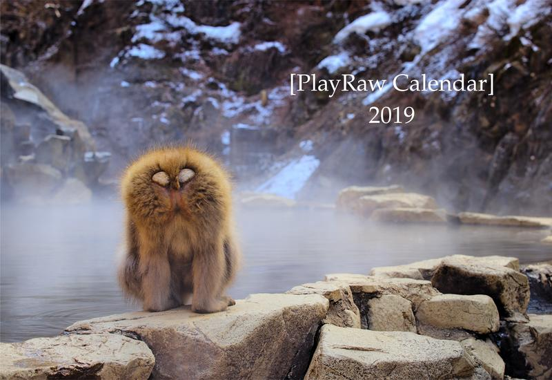
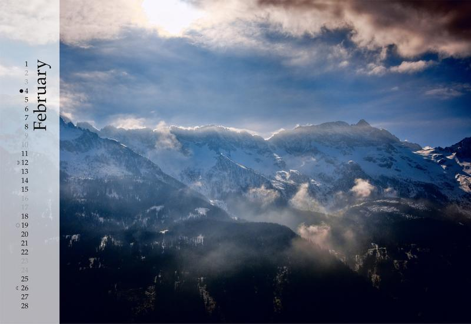
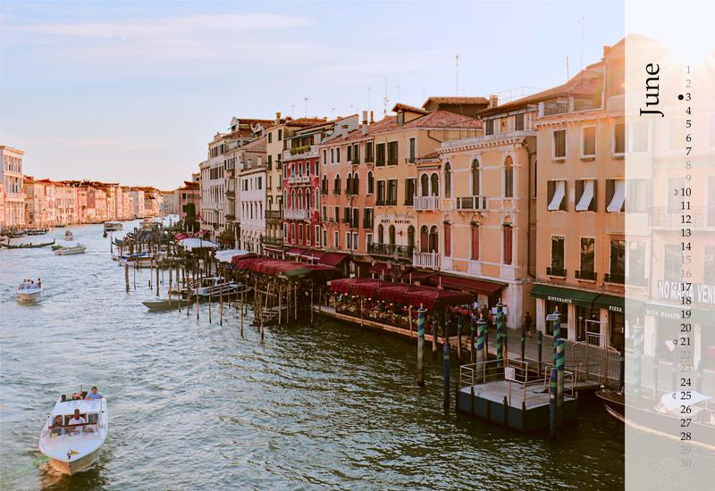

Last year I got an amazing surprise in the mail.
It was an _awesome_ calendar of a handpicked selection of results from the years [PlayRaw][] images.

Chris (@chris) put together another fantastic calendar for this year (while juggling kids, too) and it's too nice to not have a post about it!

<figure>

<figcaption>
Yep, that's the back side.  
_Monkey Business_ by Dimitrios Psychogios (<a href='https://creativecommons.org/licenses/by-sa/4.0/' title='Creative Commons Attribution-ShareAlike'>cba</a>)
</figcaption>
</figure>

<!--more-->

It was a really awesome surprise to recieve my calendar last year - and I wish I would have planned a little better to be able to grab a photo of the calendar hanging in my office \(it's my work desk calendar - it never fails to remind me that there's more fun things to life than work - also that I need to up my processing game... ).

This year Chris has done it again by assembling a wonderfully curated collection of images and edits from the various Play Raws that were posted this year.
I've plagiarized [his post on the forums](https://discuss.pixls.us/t/playraw-calendar-2019/) to put together this post and get some more publicity for his time and effort!

If you get a moment, please thank Chris for his work putting this together!

You can download the PDF: [2018 Play Raw Calendar](https://pixls-discuss.s3.dualstack.us-east-1.amazonaws.com/original/3X/0/4/04c0007ef0f0c315037c7bafb37947bb5d5a6553.pdf)

Here are the images he chose for the calendar and the edits he included:

| month | image title | photographer | editor | license |
|---|---|---|---|---|
| 0  | [Monkey Business][] | jinxos | andrayverysame | CC BY-SA |
| 1  | [Glaciers, Birds, and Seals at Jökulsárlón/Iceland][] | BayerSe | McCap | CC BY-NC-SA |
| 2  | [Shooting Into the Sun][] | davidvj | Adlatus | CC BY-SA |
| 3  | [The Rail Bridge, North Queensferry][] | Brian_Innes | Jean-Marc_Digne | CC BY-SA |
| 4  | [Sunset sea][] | Thanatomanic | sls141 | CC BY-NC-SA |
| 5  | [Vulcan stone sunset][] | asn | kazah7 | CC BY-NC-SA |
| 6  | [Venise la sérénissime][] | sguyader | Thomas_Do | CC BY-NC-SA |
| 7  | [Dockland side view at night][] | gRuGo | CriticalConundrum | CC BY-NC-SA |
| 8  | [Eating cicchetti with ghosts in Venezia][] | sguyader | msd | CC BY-NC-SA |
| 9  | [maritime museum][] | wiegemalt | yteaot | CC BY-SA |
| 10 | [Alfred’s Vision][] | jinxos | msd | CC BY-SA |
| 11 | [Crescent Moon through silhouetted fern fronds][] | martin.scharnke | gRuGo | CC BY-NC-SA  |
| 12 | [Everything frozen][] | asn | McCap | CC BY-NC-SA |

A preview (also shamelessly lifted from Chris's forum post):

These [Play Raws][PlayRaw] are a ton of fun and one of the great aspects of having such a generous community to share the images and allowing everyone to practice and play.
I am constantly humbled by the amazing work our community produces and _shares with everyone_.

**Thank you** to everyone who shared image and participated in processing (and sharing how you achieved your results)!  I have really learned some neat things based on others work and look forward to even more opportunities to play (pun intended).

Fun side note - the Play Raws are actually something that began on the old [RawTherapee][] forums.  When they moved their official forums here with us it was one of those awesome things I'm glad they brought over with them (the people were pretty great too... :)).

[Monkey Business]: https://discuss.pixls.us/t/play-raw-monkey-business/7145
[Glaciers, Birds, and Seals at Jökulsárlón/Iceland]: https://discuss.pixls.us/t/play-raw-glaciers-birds-and-seals-at-jokulsarlon-iceland/9206
[Shooting Into the Sun]: https://discuss.pixls.us/t/play-raw-shooting-into-the-sun/8713
[The Rail Bridge, North Queensferry]: https://discuss.pixls.us/t/playraw-the-rail-bridge-north-queensferry/6243
[Sunset sea]: https://discuss.pixls.us/t/play-raw-sunset-sea/7103
[Vulcan stone sunset]: https://discuss.pixls.us/t/play-raw-vulcan-stone-sunset/9618
[Venise la sérénissime]: https://discuss.pixls.us/t/playraw-venise-la-serenissime/8571
[Dockland side view at night]: https://discuss.pixls.us/t/play-raw-dockland-side-view-at-night/8237
[Eating cicchetti with ghosts in Venezia]: https://discuss.pixls.us/t/playraw-eating-cicchetti-with-ghosts-in-venezia/5805
[maritime museum]: https://discuss.pixls.us/t/play-raw-maritime-museum/8969
[Alfred’s Vision]: https://discuss.pixls.us/t/playraw-alfreds-vision/5574
[Crescent Moon through silhouetted fern fronds]: https://discuss.pixls.us/t/playraw-crescent-moon-through-silhouetted-fern-fronds/8052
[Everything frozen]: https://discuss.pixls.us/t/play-raw-everything-frozen/6855

[PlayRaw]: https://discuss.pixls.us/tags/play_raw "Play Raw posts on Discuss"
[RawTherapee]: https://www.rawtherapee.com
