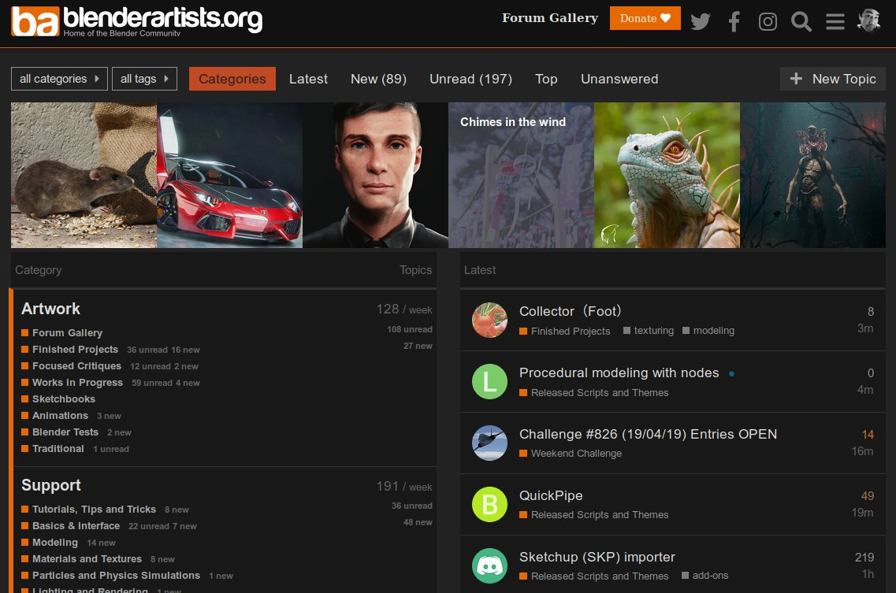

I've been a member of the community over at [blenderartists.org][BA] (previously elysiun) for a long time (it'll be _15 years_ this October according to [my profile there][]).
So it was nice to see when they finally transitioned to using [Discourse][] a little while back.

[my profile there]: https://blenderartists.org/u/pld/summary
[Discourse]: https://www.discourse.org/ "Discourse homepage"

<!--more-->

What I really liked, though, was the work that Bart did to specific pages and tag lists to display them.
Here's what their current homepage looks like:

<figure>

<figcaption>
Current blenderartists.org homepage
</figcaption>
</figure>

They use a different default main page style, "Categories" view, than we do ("Latest"). This just shows the site categories as a column on the left, then the latest posts in a column on the right.

The row of featured images along the top is actually part of a plugin that I'll get to in a moment.

If you want to change your own default main page view of the forums, you can modify it at your account `Preferences` &rarr; `Interface` (and change it to _Categories_):

<figure>

</figure>

## Fancy Category Views

The default landing page is neat, but what they did with their [forum gallery][] page is much neater:

<figure>

<figcaption>
blenderartists.org forum gallery page
</figcaption>
</figure>

They set up the [Topic List Previews][] plugin so the entire category is actually viewed as a tile of images.
I think we can all agree that this is generally a much nicer way to view categories that are heavily image-based.
Of course, I thought this was a natural fit for us as well!

So through the magic of having an invaluable resource like a darix, he was able to make it a reality for us!

We've got it implemented now on the [Play Raw][] category (now its own sub-category under the [Processing][] category), the [Critique][], and the [Showcase][] category.
If you haven't had a chance to check it out yet, please do. (darix announced it in the thread [Play raw posts and you][] so feel free to give us any further feedback in that topic.)

[Play raw posts and you]: https://discuss.pixls.us/t/play-raw-posts-and-you/11959

<figure>

<figcaption>
The Critique category
</figcaption>
</figure>

**Keep in mind** that for those categories, the preview image will correspond to the first image in the first post. Try to remember to make the first image in those category topics the one you'll want in the preview.

We haven't enabled the featured row of images after some initial feedback. We may revisit it again at some point, but hopefully the Play Raw and Showcase categories will look a little better now. It certainly makes the categories a little easier and faster to navigate now that you can see the previews directly on the page.

[Processing]: https://discuss.pixls.us/c/processing "PIXLS.US Processing Category"
[Showcase]: https://discuss.pixls.us/c/showcase "PIXLS.US Showcase Category"
[Critique]: https://discuss.pixls.us/c/critique "PIXLS.US Critique Category"

[BA]: https://blenderartists.org/ "Blender Artists"
[forum gallery]: https://blenderartists.org/c/artwork/forum-gallery "blenderartists.org gallery page"
[Topic List Previews]: https://meta.discourse.org/t/topic-list-previews/101646 "Topic List Previews Plugin"
[Play Raw]: https://discuss.pixls.us/c/processing/playraw "PIXLS.US Play Raw Category"
