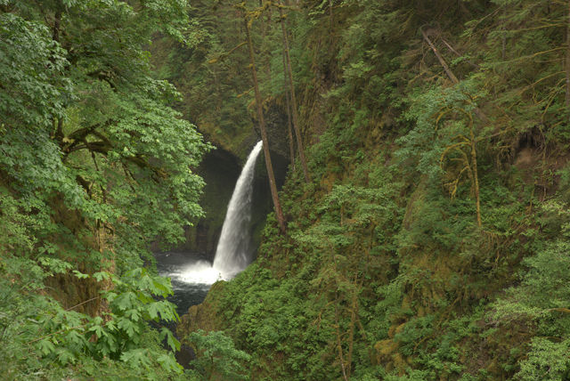
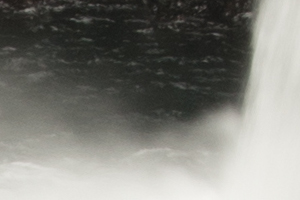

## What is Pixel Shift?

Modern digital sensors (with a few exceptions) use an arrangement of RGB filters over a square grid of photosensors.  For a given 2x2 square of photosensors the filters are designed to allow two green, and one each red and blue colors through to the photosite.  These are arranged on a grid:

<figure>

</figure>

The pattern is known as a [Bayer pattern][bayer] (after the creator Bryce Bayer of Eastman Kodak).  The resulting pattern shows how each RGB is offset into the grid.

[bayer]: https://en.wikipedia.org/wiki/Bayer_filter

<figure>

</figure>

Each of the pixel sites are only capturing a single color, though.  In order to produce a full color representation at each pixel, the other color values need to be interpolated from the surrounding grid.  This interpolation and methods for calculating it is referred to as [demosaicing](https://en.wikipedia.org/wiki/Demosaicing). The methods for accomplishing this vary across different algorithms.

<figure>

<figcaption>
The final RGB value for the initially Red pixel needs to be interpolated from the surrounding Blue and Green pixels.
</figcaption>
</figure>

### Pixel Shift

Pentax's Pixel Shift (Available on the [K-1][k1], [K-3 II][k3], [K-p][kp], [K-70][k70]) attempts to alleviate some of these problems through a novel approach of capturing four images quickly in succession and moving the entire camera sensor by a single pixel for each shot.  This has the effect of capturing a full RGB value at each pixel location:

[k1]: http://www.ricoh-imaging.co.jp/english/products/k-1/
[k3]: http://www.ricoh-imaging.co.jp/english/products/k-3-2/
[kp]: http://www.ricoh-imaging.co.jp/english/products/kp/
[k70]: http://www.ricoh-imaging.co.jp/english/products/k-70/

<figure>

<figcaption>
Pixel Shift shifts the sensor by one pixel in each direction to be able to generate a full set of RGB values at each photosite.
</figcaption>
</figure>

This means a full RGB value for a pixel location can be created without having to interpolate from neighboring values.

### Advantages

#### Less Noise

 If you look carefully at the Bayer pattern, you'll notice that when shifting to adjacent pixels there will always be two green values captured per pixel.  The average of these green values helps to suppress noise that may have been interpolated and spread through a normal, single shot raw file.

<figure>

<figcaption>
Top: single raw frame, Bottom: Pixel Shift
</figcaption>
</figure>

#### Less Moire

Avoiding the interpolation of pixel colors from surrounding photosites helps to reduce the appearance of Moire in the final result:
 
<figure>

<figcaption>
Top: single raw frame, Bottom: Pixel Shift
</figcaption>
</figure>

#### Increased Resolution

This method is similar in concept to what was previously seen when Olympus announced their "High Resolution" mode for the OMD E-M5mkII camera.  In that case they combine 8 frames moved by sub-pixel amounts to increase the overall resolution.  The difference here is that Olympus generates a single, combined raw file from the results, while Pixel Shift gets you access to each of the four raw files before they're combined.

In each case, a higher resolution image can be created from the results:
 
<figure>

<figcaption>
Top: single raw frame, Bottom: Pixel Shift
</figcaption>
</figure>

### Disadvantages

#### Movement

As with most approaches for capturing multiple images and combining them, a particularly problematic area is when there are objects in motion between the frames being captured.  This is a common problem for panorama photography when stitching the image together, image stacks for noise reduction, as well as image combining methods like Pixel Shift.

Although...

## RawTherapee Approach

Simply combining four static frames together is really trivial, and is something that all the other pixelshift capable software can do without issue. The real world is not often so accommodating as a studio setup, and that is where the recent work done by Ingo and Ilias on RawTherapee really begins to shine.

What they've been working on in RawTherapee is to improve the _detection of movement_ in a scene.  There are several types of movement possible such as

* Objects showing at different places in a scene such as fast moving cars.
* Partly moving objects like foliage in the wind.
* Moving objects reflecting light onto static objects in the scene
* Changing illumination conditions such as long exposures at sunset.

All of these types of movement need to be detected to avoid the artifacts they may cause in the final shot.

One of the key features of Pixel Shift movement detection in RawTherapee is that it allows you to show the movement mask, so you get feedback on which regions of the image are detected as movement and which are static.  For the regions with movement RawTherapee will then use the demosaiced frame of your choice to fill it in, and for regions without movement it will use the Pixel Shift combined image with more detail and less noise.

<figure class='big-vid'>

<figcaption>
Unique to RawTherapee is the option to export the resulting motion mask  
(for those that may want to do further blending/processing manually).
</figcaption>
</figure>

The accuracy of movement detection in RawTherapee leads to much better handling of motion artifacts that works well in places where proprietary solutions fall short (see below).  For most cases the Automatic motion correction mode works well, but you can also fine tune the parameters in custom mode to correctly detect motion in high ISO shots.

Besides being the only option (barring dcrawps possibly) to process Pixel Shift files in Linux, RawTherapee has some other neat options that aren't found in other solutions. One of them is the ability to export the actual movement mask separate from the image. This will let users generate separate outputs from RT, and to combine them later using the movement mask. Another option is the ability to choose which of the other frames to use for filling in the movement areas on the image.

## A Comparison of Other Software (Processing Pixel Shift)

Pentax has software to process these files, Pentax Digital Camera Utility (SilkyPix), but as with most vendor-bundled software it can be slow, unwieldy, and a little buggy sometimes.  Having said that, the results do look good, and at least the "Motion Correction" is able to be utilized with this software.

Adobe Camera Raw (ACR) got support for Pixel Shift files in version 9.5.1 (but doesn't utilize the "Motion Correction").  In fact, ACR didn't have support at the time that [DPReview.com](https://www.dpreview.com) looked at the feature last year (causing them to retract the article and re-post when they had a chance to use a version of ACR with support).

In a [recent look at Pixel Shift](https://www.dpreview.com/reviews/k1-pixel-shift-resolution-updated-field-test) processing over at DPReview.com, they got some interesting results.  

[issues]: https://www.dpreview.com/reviews/k1-pixel-shift-resolution-updated-field-test#reviewImageComparisonWidget-52182546

<figure>

<figcaption>
The image used in the DPReview article. &copy;[Chris M Williams](https://www.dpreview.com/reviews/k1-pixel-shift-resolution-updated-field-test)
</figcaption>
</figure>

We're going to look at some 100% crops from that article and compare them to the results available using recent version of RawTherapee.

Looking first at an area of foliage with motion, the places where there are issues [becomes apparent][issues].

For reference, here is the Adobe Camera Raw (ACR) version of one frame from a Pixel Shift file:

<figure>

</figure>

The results with Pixel Shift on, and motion correction on, from straight-out-of-camera (SOOC), Adobe Camera Raw (ACR), SilkyPix, and RawTherapee (RT) are decidedly mixed.  In all but the RT version, there's a very clear problem with effective blending and masking of the frames in areas with motion:

<figure>

<figcaption>

</figcaption>
</figure>

<!-- 
ACR raw, PS on, motion correction on:

SOOC JPEG, PS on, motion correction on:

SilkyPix raw, PS on, motion correction on:

RawTherapee, Pixel Shift on, motion correction off:

RawTherapee, Pixel Shift on, motion correction (Auto):

-->

---

Things look much worse for Adobe Camera Raw when looking at high-motion areas like the water spray at the foot of the waterfall, though SilkyPix does much better job here.

The ACR version of one frame for reference:

<figure>

</figure>

Both the SOOC and SilkyPix versions handle all of the movement well here.  RawTherapee also does a great job blending the frames through all of the movement.  Adobe Camera Raw is not doing well at all...

<figure>

</figure>

<!-- 
ACR raw, PS on, motion correction on:

SOOC JPEG, PS on, motion correction on:

SilkyPix raw, PS on, motion correction on:

RawTherapee, Pixel Shift on, motion correction off:

RawTherapee, Pixel Shift on, motion correction (Auto):

-->

* * *

Finally, in a frame full of movement, such as the surface of the water.

The ACR version of one frame for reference:
<figure>

</figure>

In a frame full of movement the SOOC, ACR, and SilkyPix processing all struggle to combine a clean set of frames together.  They exhibit a pixel pattern from the processing, and the ACR version begins to introduce odd colors:

<figure>

</figure>

<!-- 
ACR raw, PS on, motion correction on:

SOOC JPEG, PS on, motion correction on:

SilkyPix raw, PS on, motion correction on:

RawTherapee, Pixel Shift on, motion correction off:

RawTherapee, Pixel Shift on, motion correction (Auto):

-->

As mentioned earlier, a unique feature of RawTherapee is the ability to export the motion mask.  Here is an example of the motion mask for this image (overlayed on the image itself):

<figure>

<figcaption>
The motion mask generated by RawTherapee for the above image.
</figcaption>
</figure>

### In Conclusion

In another example of the power and community of Free/Libre and Open Source Software we have a great enhancement to a project based on feedback and input from the users.  In this case, it all started with a [post on our forums](https://discuss.pixls.us/t/support-for-pentax-pixel-shift-files-3489/2560).

Not so coincidentally, community member [@nosle](https://discuss.pixls.us/users/nosle) gave permission to use one of his PS files for everyone to try processing.  You can find the file and everyone's results on the [Play pixelshift thread](https://discuss.pixls.us/t/play-pixelshift/3142).

Pixel Shift is currently in the development branch of RawTherapee and is slated for release with version 5.1.
